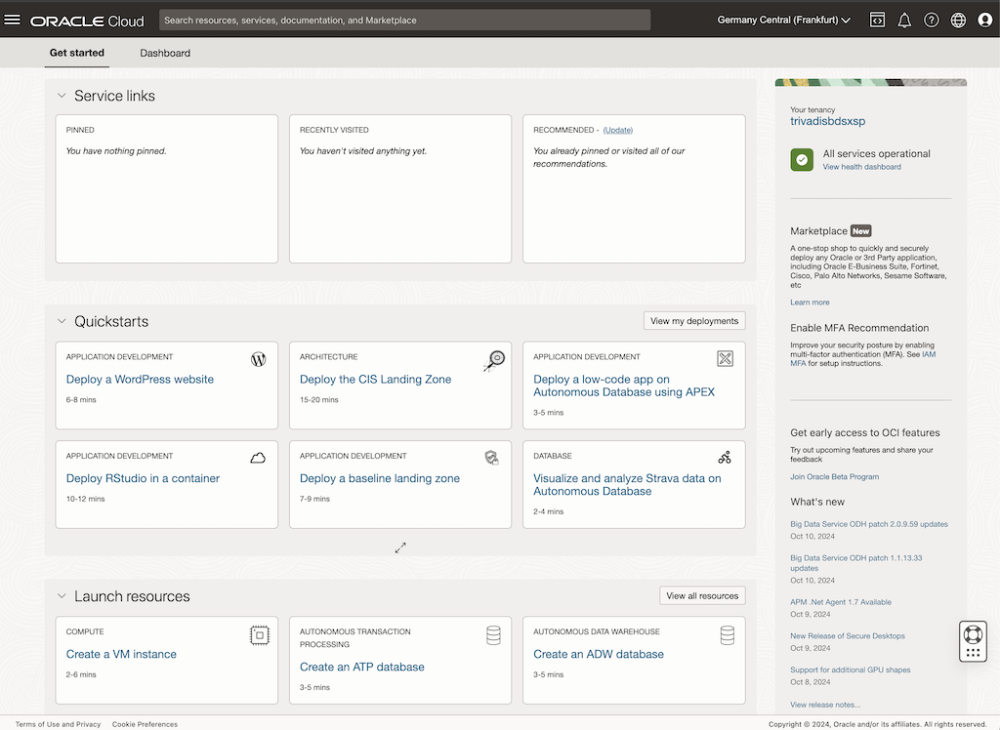

<!-- markdownlint-disable MD013 -->
<!-- markdownlint-disable MD025 -->
# Requirements for Oracle Cloud (OCI) Security Workshop

Have you always wanted to explore the full functionality of the security features of *Oracle Cloud Infrastructure (OCI)* but never found the time? Then our *Oracle Cloud Infrastructure Security - The Practical Workshop* is the perfect opportunity for you. After a theoretical introduction, we will dive straight into practical work in the cloud. Participants will explore various security topics using real-life examples. For the duration of the workshop, you will have access to a dedicated *Oracle Cloud Environment*. All examples and exercises will be stored in a *GitHub* repository, which will remain accessible after the event.

## Prerequisites and Skills

The workshop allows a step-by-step introduction to *Oracle Cloud Infrastructure (OCI)* security concepts. The following skills are recommended for participants:

- Experience working with shell scripts, SSH, and command-line tools.
- Basic knowledge of Oracle Database fundamentals, such as installation, configuration, and administration.
- Familiarity with Git and *[GitHub](https://github.com/)* is recommended.

## Oracle Cloud Infrastructure (OCI) Environment

The practical exercises will take place in the *Oracle Cloud Infrastructure (OCI)* Console. You will need a laptop with internet access and a modern browser.

Mandatory prerequisites:

- Access to *Oracle Cloud Infrastructure (OCI)*. Access to an OCI tenant will be provided as part of the workshop.
- Laptop with internet access via conference Wi-Fi.
- A modern browser that supports *Oracle Cloud Infrastructure (OCI)*. See also [Supported Browsers](https://docs.oracle.com/en-us/iaas/Content/GSG/Tasks/signinginIdentityDomain.htm#Supporte).
- Personal tools for taking notes and editing shell scripts.

::: note
**Note:** Please test your access to [cloud.oracle.com](cloud.oracle.com) via Wi-Fi during the conference. On the workshop day, we will focus on the workshop topics and may have limited time to troubleshoot network access.
:::

Additional recommended tools, though not required for the workshop:

- GitHub account for accessing and downloading the source code (basic download is available without an account).
- SSH terminal such as Putty, MobaXterm, or OpenSSH.
- SQL tools like SQL Developer, Toad, or similar for database access.
- Text editor or development tool (e.g., *Microsoft Visual Studio Code*).
- A personal *Oracle Cloud Infrastructure (OCI)* environment to continue learning after the workshop.

## Documentation and References

The following resources will be helpful during the *Oracle Cloud Security Workshop*:

- Oracle Cloud Infrastructure Documentation [Overview](https://docs.oracle.com/en-us/iaas/Content/home.htm)
- Oracle Cloud Infrastructure Documentation [Getting Started](https://docs.oracle.com/en-us/iaas/Content/GSG/Concepts/baremetalintro.htm)
- Oracle Cloud Infrastructure Documentation [Command Line Interface (CLI)](https://docs.oracle.com/en-us/iaas/Content/API/Concepts/cliconcepts.htm)
- Oracle Cloud Infrastructure Documentation [Oracle Data Safe](https://docs.oracle.com/en/cloud/paas/data-safe)
- Center for Internet Security (CIS) [Benchmarks](https://www.cisecurity.org/cis-benchmarks) 
- Microsoft [Visual Studio Code](https://code.visualstudio.com/)
- [Excalidraw](https://excalidraw.com/) - A virtual collaborative whiteboard tool
