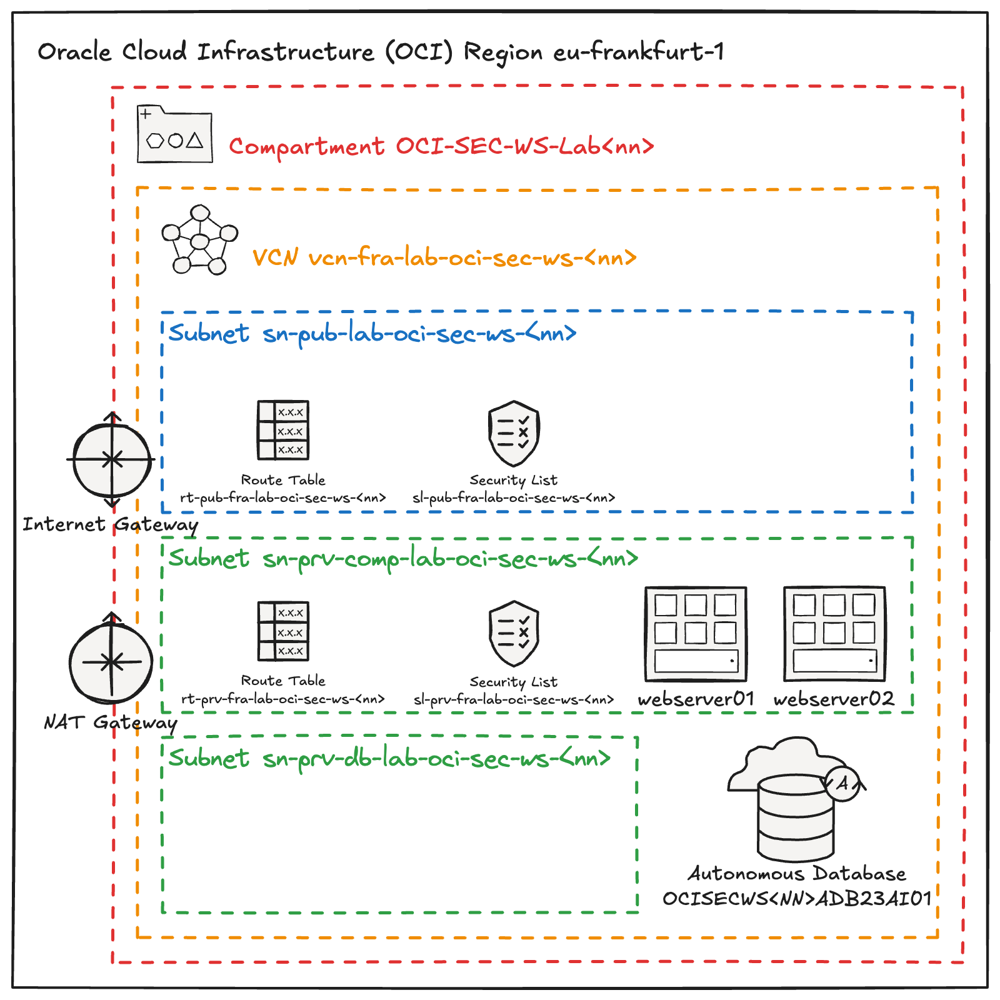

<!-- markdownlint-disable MD013 -->
<!-- markdownlint-disable MD025 -->
<!-- markdownlint-configure-file { "MD024":{"allow_different_nesting": true }} -->

# Lab Overview
<!-- markdownlint-disable MD041 -->
<!-- markdownlint-disable MD051 -->

## Oracle Cloud Infrastructure (OCI) Security Workshop Architecture

The following diagram illustrates the architecture set up for the Oracle Cloud
Infrastructure (OCI) Security Workshop environment. Each participant will have
access to a similar setup to perform a series of hands-on security exercises.

## Key Components of the Architecture

- **Region: eu-frankfurt-1** - The environment is hosted in the Frankfurt region.
- **Compartment (OCI-SEC-WS-Lab):** A dedicated compartment is created for each
  workshop environment, isolating resources and managing security controls.
- **Virtual Cloud Network (VCN):** The VCN (`vcn-fra-lab-oci-sec-ws-<nn>`) forms
  the network boundary for the resources within the lab.
  - **Public Subnet:** Contains resources accessible from the internet, secured
    by a route table and security lists.
  - **Private Subnet for Compute:** A private subnet hosting compute instances
    (e.g., web servers `webserver01` and `webserver02`), isolated from public access.
  - **Private Subnet for Database:** A subnet dedicated to hosting the Autonomous
    Database (`OCISECWS<nn>ADB23AI01`).
- **Gateways:**
  - **Internet Gateway:** Allows public internet access for the resources in the
    public subnet.
  - **NAT Gateway:** Facilitates secure outbound internet traffic for the private
    resources.
  
## **Lab Exercise Focus Areas:**

1. **Key Management:** Create a vault to manage encryption keys and apply them to
   resources.
2. **Cloud Guard:**
   - **Manual Remediation:** Detect and manually resolve public object storage buckets.
   - **Auto Remediation:** Automatically respond to potential security risks, like public bucket visibility.
   - **Notification Setup:** Configure alerts to be informed of any detected issues.
3. **Data Safe:** Setting up and configuring Oracle Data Safe for enhanced data security.
4. **Security Zones / Web Application Firewall:** Ensuring compliance with Security Zones and protecting web applications.
