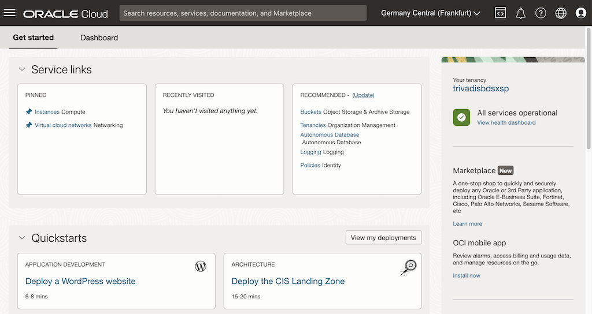
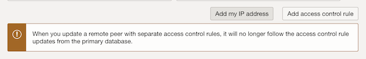
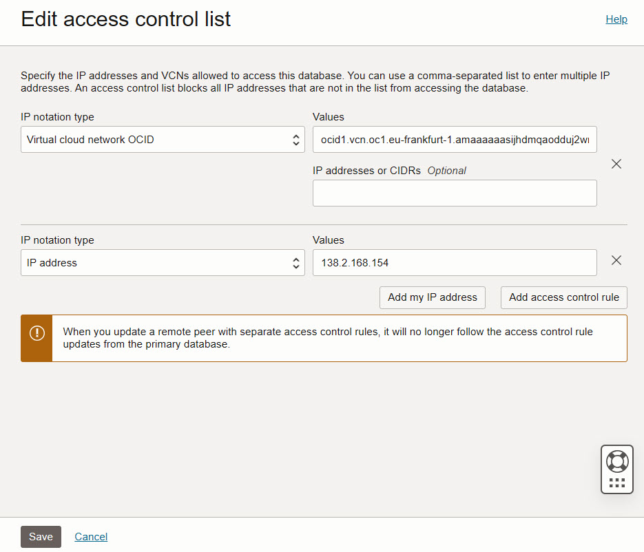
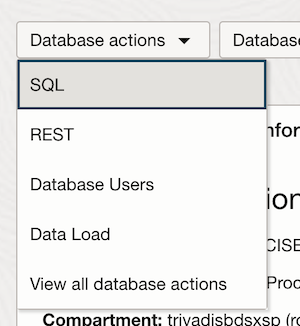
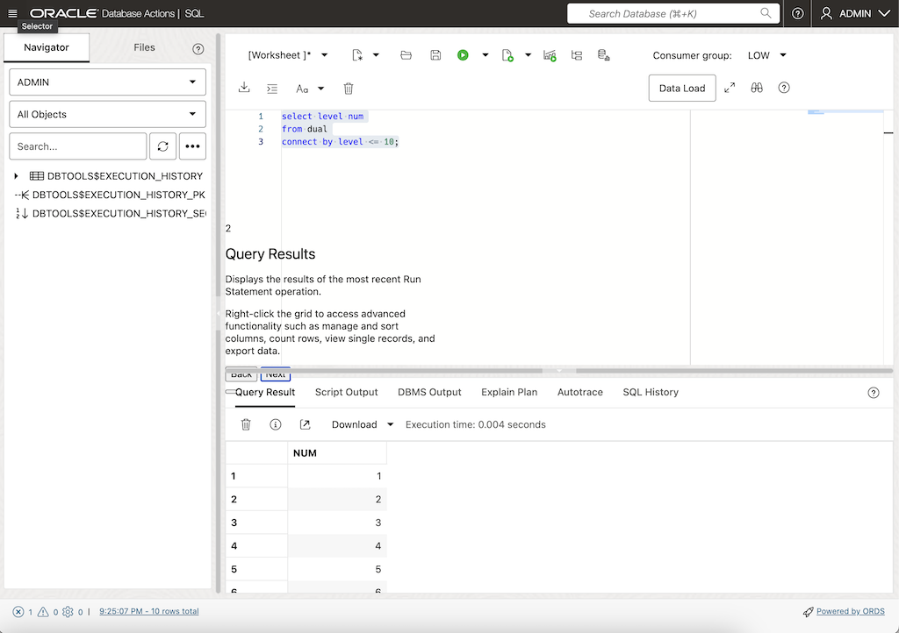

<!-- markdownlint-disable MD013 -->
<!-- markdownlint-disable MD024 -->
<!-- markdownlint-disable MD029 -->
<!-- markdownlint-disable MD033 -->

## Exercise 00: Getting Started with OCI

In this exercise, you will explore the Oracle Cloud Infrastructure (OCI) environment. This includes logging in, navigating the OCI Console, using the Cloud Shell, and configuring network and database access to the Autonomous Database (ADB).

### Objectives

- Log in to the OCI Console and explore its interface.
- Access and use the OCI Cloud Shell for basic tasks.
- Verify connectivity to the Autonomous Database (ADB).
- Configure network and database access for ADB.

## Environment {.unlisted .unnumbered}

Perform this exercise within the following environment:

- **Compartment:** `OCI-SEC-WS-LAB-nn`
- **Region:** Germany Central (Frankfurt)
- **OCI Console URL:** [OCI Console Frankfurt - Login](https://console.eu-frankfurt-1.oraclecloud.com){:target="_blank" rel="noopener"}

Verify that you are in the correct compartment and region. Any new resources, including Cloud Shell configurations and ADB access settings, should be created within the specified compartment.

## Solution {.unlisted .unnumbered}

### Step 1: First Login to OCI Console

1. Log in to the **[Oracle Cloud Console](https://cloud.oracle.com/)** with your assigned credentials.
2. Familiarize yourself with the main console features:
   - **Navigation Menu**: Provides access to services such as Compute, Networking, Storage, and Databases.
   - **Resource Summary**: Displays an overview of resources in your compartment.
   - **Quick Actions**: Offers shortcuts for frequently used tasks like creating instances.

   

### Step 2: Using the Cloud Shell

1. Open the **Cloud Shell** from the top-right corner of the OCI Console.

2. Explore basic Cloud Shell commands:

   ```bash
   # Verify the active user
   whoami

   # List the current files and directories
   ls -la
   ```

   - Check current Object Storage Namespace
  
     ```bash
     oci os ns get
     ```

   - Check environment variables for OCI_CS e.g. User ID, Hosts etc.
  
     ```bash
     env |grep -i oci_cs
     ```

3. **Create Private Network for Cloud Shell**
   To be able to connect from OCI Clud Shell to the Autonomous Database,
   private network connection is required.

   Select _Private network definition list_.

   

   Click on _Create private network definition_.

   

It is important to create the cloud shell network for
the private subnet.
Set:

- Name: A simple name to identify the cloud shell network
- VCN in Compartment: Select your lab VCN, if the list is empty, verfy the proper compartment is selected.
- Subnet in Compartment: Select your lab subnet starting with sn-prv-comp-fra, if the list is empty, verfy the proper compartment is selected.
- Use as actve network: Enable checkbox


Create the private network definition. When the network is created, you can
close the window.


On top bar of the cloud shell, the new network is active. This requires a couple of seconds, please
be patient.


### Step 3: Configure Autonomous Database ACL

1. Retrieve your **Cloud Shell IP address**:

   ```bash
   curl ifconfig.me
   ```

   - Example output: `138.2.168.154`.
   - If no value is returned, it indicates that the wrong network is active.

2. Add your Cloud Shell IP address to the **Access Control List (ACL)** of the ADB instance.

Go to Oracle Database -> Autonomous Database.

Select your Autonomous Database by a click on the display name. Verify, correct compartment
is selected.


In dashboard, click on the link to edit the Access control list.


There is always an entry for a VCN, we add another entry by click on _Add access control rule_.


- IP notation type: IP address
- Values: your Cloud Shell IP address from above output, as example 138.2.168.154
- In addition to the IP address of the cloud shell, also add your client IP address. To do this, click the *Add my IP address* button.



Click on _Save_ to store the settings.



### Step 4: Download ADB Wallet and Connect

Go back to your Cloud Shell, ensure the private network is active.

List your Autonomous Database in your compartment. Replace the filter for compartment by your compartment name. Example for compartment

Example for compartment MGB-DEV-OCI-SEC-WS-LAB-00, an OCID is returned, this OCID is used to get the ADB
connection wallet.

```bash
oci db autonomous-database list --compartment-id $(
    oci iam compartment list --all --compartment-id-in-subtree true | jq -r '.data[] | select(.name == "MGB-DEV-OCI-SEC-WS-LAB-00") | .id'
) | jq -r '.data[].id'
ocid1.autonomousdatabase.oc1.eu-frankfurt-1.antheljtsijhdmqawkm7y2bpzwohbeyoxrf5zl2bydkx6isqxwkjii987651234

```

Create a new directory, change into this directory.

```bash
mkdir my_wallet && cd my_wallet
```

Download the Autonomous Database wallet, use the ADB OCID from query above. Define the output filename and the wallet password. Example:

```bash
oci db autonomous-database generate-wallet --autonomous-database-id ocid1.autonomousdatabase.oc1.eu-frankfurt-1.antheljtsijhdmqawkm7y2bpzwohbeyoxrf5zl2bydkx6isqxwkjii3zunka --file my-wallet.zip --password Oracle123
```

Example output:

```bash
lab_soe_de@cloudshell:my_wallet (eu-frankfurt-1)$ oci db autonomous-database generate-wallet --autonomous-database-id ocid1.autonomousdatabase.oc1.eu-frankfurt-1.antheljtsijhdmqaqffwlx66juwm2ognwnpr2jkoluhkmh3m62u66altm2ja --file my-wallet.zip --password Oracle123
```

A file is created locally in Cloud Shell. Extract the file.

```bash
unzip my-wallet.zip 
```

Example output:

```bash
Archive:  my-wallet.zip
  inflating: ewallet.pem             
  inflating: README                  
  inflating: cwallet.sso             
  inflating: tnsnames.ora            
  inflating: truststore.jks          
  inflating: ojdbc.properties        
  inflating: sqlnet.ora              
  inflating: ewallet.p12             
  inflating: keystore.jks            
```

Change parameter in sqlnet.ora file with your path:

```bash
sed -i "s|?\(/network/admin\)|$(pwd)|" sqlnet.ora
```

Verify the file using `cat sqlnet.ora`, your path should be inserted, as example:

```bash
$ cat sqlnet.ora
WALLET_LOCATION = (SOURCE = (METHOD = file) (METHOD_DATA = (DIRECTORY="/home/lab_mgb_de/my_wallet")))
```

Get the connect alias for TPURGENT connect, example:

```bash
grep -o '^[^ ]*tpurgent' tnsnames.ora
```

Example output:

```bash
lab_mgb_de@cloudshell:my_wallet (eu-frankfurt-1)$ grep -o '^[^ ]*tpurgent' tnsnames.ora
mgbdevocisecws00atp23ai01_tpurgent
```

Set TNS_ADMIN variable.

```bash
export TNS_ADMIN=$(pwd)
```

Connect by sqlplus, use the alias from above. Example:

```bash
sqlplus admin@mgbdevocisecws00atp23ai01_tpurgent

SQL*Plus: Release 19.0.0.0.0 - Production on Wed Nov 20 15:31:48 2024
Version 19.10.0.0.0

Copyright (c) 1982, 2021, Oracle.  All rights reserved.

Enter password: 
Last Successful login time: Mon Nov 18 2024 22:14:53 +00:00

Connected to:
Oracle Database 23ai Enterprise Edition Release 23.0.0.0.0 - Production
Version 23.6.0.24.10

SQL>
```

### Step 5: Test ADB Actions

Go to Oracle Database -> Autonomous Database.

Select your Autonomous Database by a click on the display name. Verify, correct compartment
is selected.


On the top click on the left button **Database Actions** and select **SQL**.



Start the SQL Worksheet and run a test query.



## Summary {.unlisted .unnumbered}

In this exercise, you:

- Logged in to the OCI Console and explored its features.
- Used the Cloud Shell for basic commands and configurations.
- Configured network access to connect to the Autonomous Database (ADB).
- Downloaded the ADB Wallet and successfully connected to the database using `sqlplus`.

You are now ready to proceed to the next exercise, where you will explore key management and advanced OCI security features.

<!-- For Pandoc -->
- **Previous Exercise:** [Workshop Overview](#workshop-overview)
- **Next Exercise:** [Exercise 01: Key Management](#exercise-01-key-management)

<!-- For Jekyll -->
<!-- 
- **Previous Exercise:** [Workshop Overview](../README.md)
- **Next Exercise:** [Exercise 01: Key Management](../ex01/1x01-Exercise.md)
-->
