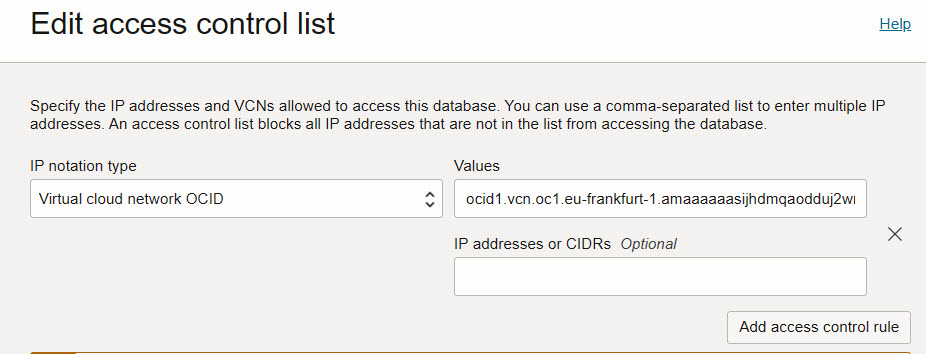

<!-- markdownlint-disable MD013 -->
<!-- markdownlint-disable MD024 -->
<!-- markdownlint-disable MD029 -->
<!-- markdownlint-disable MD033 -->

## Exercise 00: Getting Started with OCI

This exercise introduces participants to the Oracle Cloud Infrastructure (OCI)
environment. You will log in, navigate the OCI console, explore the Cloud Shell,
and configure access to the Autonomous Database (ADB).

### Objectives

- Log in to the OCI console and navigate the environment.
- Explore the OCI Cloud Shell.
- Test access to the Autonomous Database (ADB).
- Configure network and database access for ADB.

## Environment {.unlisted .unnumbered}

Perform this exercise within the following environment:

- **Compartment:** `OCI-SEC-WS-LAB-nn`
- **Region:** Germany Central (Frankfurt)
- **OCI Console URL:** [OCI Console Frankfurt - Login](https://console.eu-frankfurt-1.oraclecloud.com){:target="_blank" rel="noopener"}

Ensure you are in the correct compartment and region. New resources, such as
Cloud Shell configurations and ADB access settings, should be created within
your designated compartment.

## Solution {.unlisted .unnumbered}

### Step 1: First Login to OCI Console

1. **Access the OCI Console**  
   Go to [Oracle Cloud Console](https://cloud.oracle.com/). Log in with your
   credentials.

2. **Explore the Console Dashboard**  
   Familiarize yourself with the main console sections:
   - **Navigation Menu**: Access services such as Compute, Networking, Storage,
     and Databases.
   - **Resource Summary**: Overview of resources within your compartment.
   - **Quick Actions**: Shortcuts to commonly used tasks like creating instances.

**Example Output:**

```text
OCI Console loaded successfully, with options for Compute, Storage, Networking,
Databases, and more.
```

### Step 2: Using the Cloud Shell

1. **Open Cloud Shell**  
   Click on the Cloud Shell icon in the top-right corner of the console. Wait
   for the shell to initialize.

2. **Test Basic Commands**  
   - Check current Object Storage Namespace
  
     ```bash
     oci os ns get
     ```

3. **Create Private Network for Cloud Shell**
   To be able to connect from OCI Clud Shell to the Autonomous Database,
   private network connection is required.

   Select _Private network definition list_.


Click on _Create private network definition_.


It is importmant to create the cloud shell network for
the private subnet.
Set:

- Name: A simple name to identify the cloud shell network
- VCN in Compartment: Select your lab VCN, if the list is empty, verfy the proper compartment is selected.
- Subnet in Compartment: Select your lab subnet starting with sn-prv-comp-fra, if the list is empty, verfy the proper compartment is selected.
- Use as actve network: Enable checkbox


Create the private network definition. When the network is created, you can
close the window.


On top bar of the cloud shell, the new network is active.


### Step 3: Configure Autonomus Database ACL to allow Cloud Shell connections

Get our Cloud Shell IP address. When no value is returned, the
wrong network is active. Example for cloud shell IP address 138.2.168.154.

The IP adress is used in next steps.

```bash
$ curl -s checkip.dyndns.org | sed -e 's/.*Current IP Address: //' -e 's/<.*$//'
138.2.168.154
```

In OCI Console, add thos IP addess in Autonomus Database Access Control List.

Oracle Database > Autonomous Database.

Select your Autonomus Database by a click on the display name.


In dashboard, click on the link to edit the Access control list.


There is always an entry for a VCN, we add another entry by click on _Add access control rule_.



- IP notation type: IP address
- Values: your Cloud Shell IP address from above output, as example 138.2.168.154

Click on _Save_ to store the settings.


### Step 4: Download ADB Wallet and connect to the Autonomous Database

Go back to your Cloud Shell, ensure the private network is active.

List your Autonomous Database in your compartment. Replace the filter for compartment by your compartment name. Example for compartment

Example for compartment MGB-DEV-OCI-SEC-WS-LAB-00, an OCID is returned:

```bash
oci db autonomous-database list --compartment-id $(
    oci iam compartment list --all --compartment-id-in-subtree true | jq -r '.data[] | select(.name == "MGB-DEV-OCI-SEC-WS-LAB-00") | .id'
) | jq -r '.data[].id'

```

Create a new directory, change into this directory.

```bash
mkdir my_wallet && cd my_wallet
```

Download the Autonomous Database wallet, use the ADB OCID from query above. Example:

```bash
oci db autonomous-database generate-wallet --autonomous-database-id ocid1.autonomousdatabase.oc1.eu-frankfurt-1.antheljtsijhdmqawkm7y2bpzwohbeyoxrf5zl2bydkx6isqxwkjii3zunka --file my-wallet.zip --password Oracle123
Downloading file  [####################################]  100%
```

A file is created locally in Cloud Shell. Extract the file.

```bash
unzip my-wallet.zip 
Archive:  my-wallet.zip
  inflating: ewallet.pem             
  inflating: README                  
  inflating: cwallet.sso             
  inflating: tnsnames.ora            
  inflating: truststore.jks          
  inflating: ojdbc.properties        
  inflating: sqlnet.ora              
  inflating: ewallet.p12             
  inflating: keystore.jks            
```

Change parameter in sqlnet.ora file with your path:

```bash
sed -i "s|?\(/network/admin\)|$(pwd)|" sqlnet.ora
```

Verify the file, your path should be inserted, as example:

```bash
WALLET_LOCATION = (SOURCE = (METHOD = file) (METHOD_DATA = (DIRECTORY="/home/lab_mgb_de/my_wallet")))
```

Get the connect alias for TPURGENT connect, example:

```bash
grep -o '^[^ ]*tpurgent' tnsnames.ora
mgbdevocisecws00atp23ai01_tpurgent
```

Set TNS_ADMIN variable.

```bash
export TNS_ADMIN=$(pwd)
```

Connect by sqlplus, use the alias from above. Example:

```bash
sqlplus admin@mgbdevocisecws00atp23ai01_tpurgent

SQL*Plus: Release 19.0.0.0.0 - Production on Wed Nov 20 15:31:48 2024
Version 19.10.0.0.0

Copyright (c) 1982, 2021, Oracle.  All rights reserved.

Enter password: 
Last Successful login time: Mon Nov 18 2024 22:14:53 +00:00

Connected to:
Oracle Database 23ai Enterprise Edition Release 23.0.0.0.0 - Production
Version 23.6.0.24.10

SQL>
```

- List available compartments:

 ```bash
 oci iam compartment list --all
 ```

**Example Output:**

```text
User details loaded successfully.
Compartment list:
- OCI-SEC-WS-LAB-01
- OCI-SEC-WS-LAB-02
...
```

### Step 3: Accessing the Autonomous Database (ADB)

1. **Navigate to Autonomous Databases**  
   Go to **Oracle Database** > **Autonomous Transaction Processing** or
   **Autonomous Data Warehouse**.

2. **Select Your Database Instance**  
   Click on your ADB instance to view its details, including connection strings,
   CPU usage, and storage information.

3. **Download Wallet for Database Connection**  
   - Click **DB Connection** and select **Download Wallet**.
   - Enter a password to secure the wallet file and save it.

**Example Output:**

```text
Wallet downloaded successfully to Wallet_<DB_NAME>.zip.
```

### Step 4: Configuring Access to Autonomous Database

1. **Upload Wallet to Cloud Shell**  
   Use the Cloud Shell upload feature to upload the wallet if it's on your local
   machine.

2. **Set Up Environment Variables**  
   Unzip the wallet and set environment variables:

   ```bash
   mkdir -p wallet
   unzip Wallet_<DB_NAME>.zip -d wallet
   export TNS_ADMIN=wallet
   ```

3. **Test Database Connection**  
   Use `sqlplus` or `sqlcl` to connect:

   ```bash
   sqlplus admin@<DB_SERVICE>
   ```

**Example Output:**

```plaintext
Connected to:
Oracle Database 19c Enterprise Edition Release 19.0.0.0.0 - Production
...
SQL>
```

## Summary {.unlisted .unnumbered}

In this exercise, you:

- Logged into the OCI Console and explored its features.
- Familiarized yourself with the Cloud Shell and basic commands.
- Accessed and configured the Autonomous Database (ADB).

You are now ready to continue with the next exercise to expand your skills in
OCI security.

<!-- For Pandoc -->
- **Previous Exercise:** [Workshop Overview](#workshop-overview)
- **Next Exercise:** [Exercise 01: Key Management](#exercise-01-key-management)

<!-- For Jekyll -->
<!-- 
- **Previous Exercise:** [Workshop Overview](../README.md)
- **Next Exercise:** [Exercise 01: Key Management](../ex01/1x01-Exercise.md)
-->
