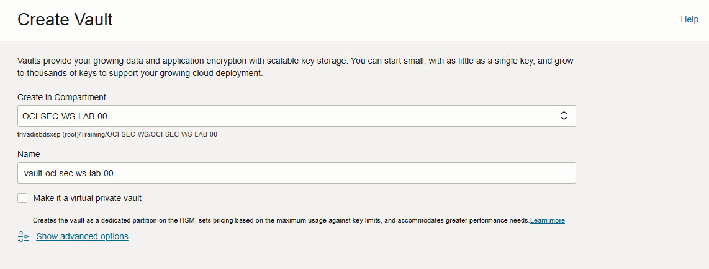
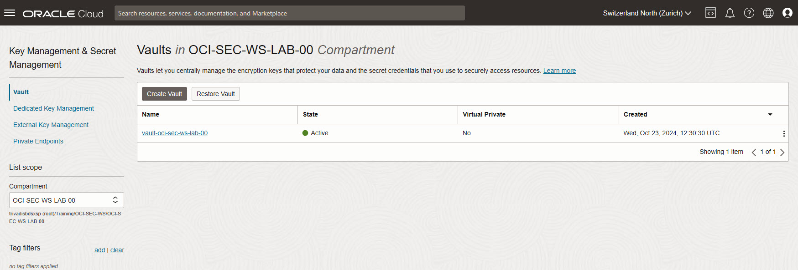
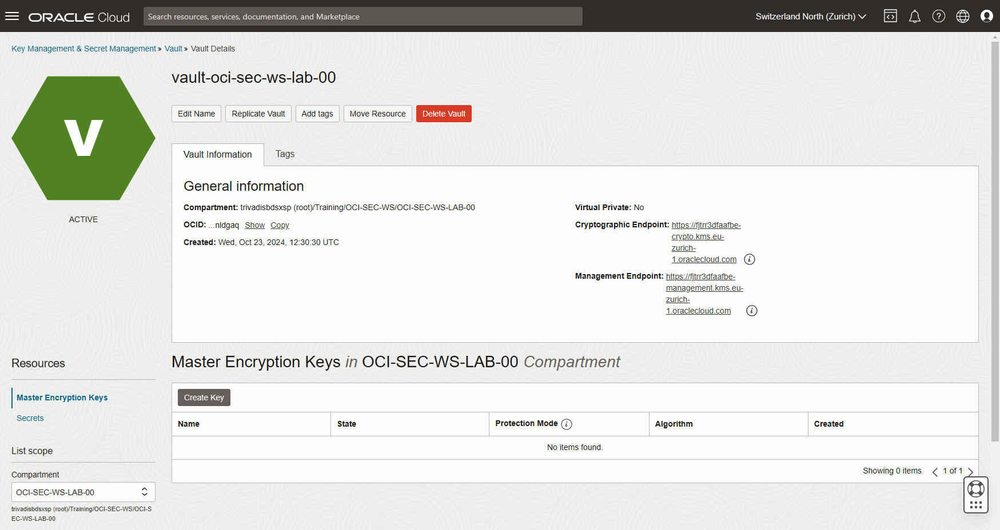
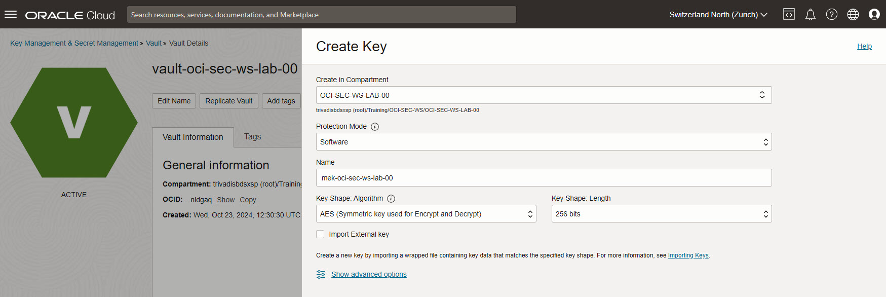
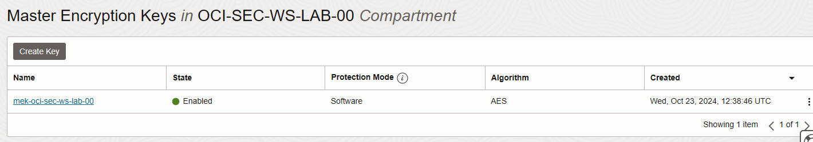
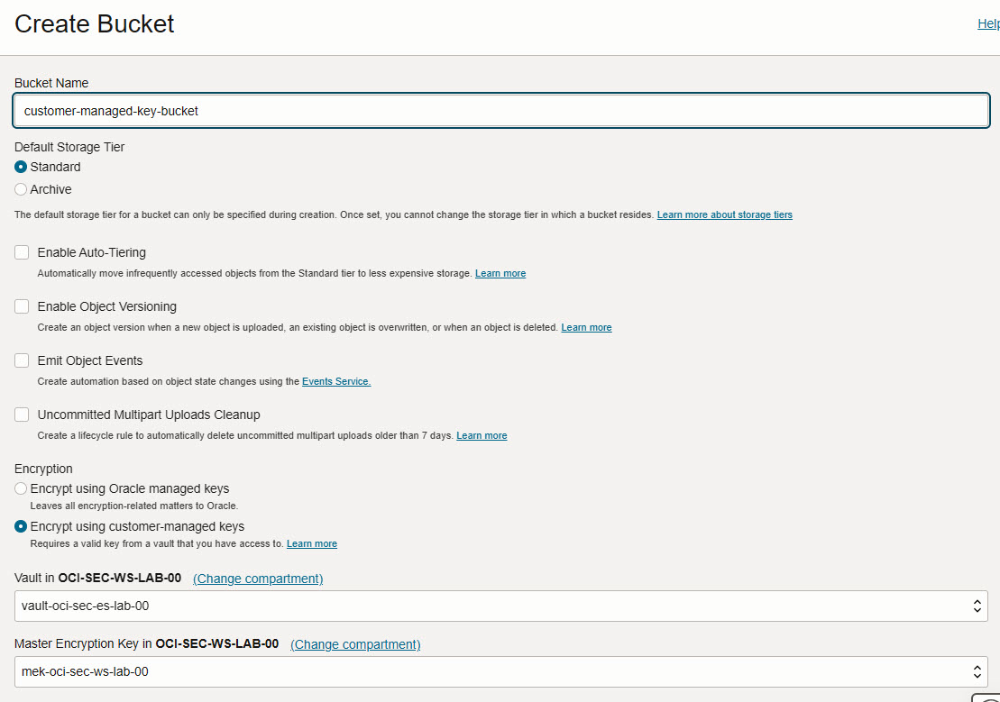
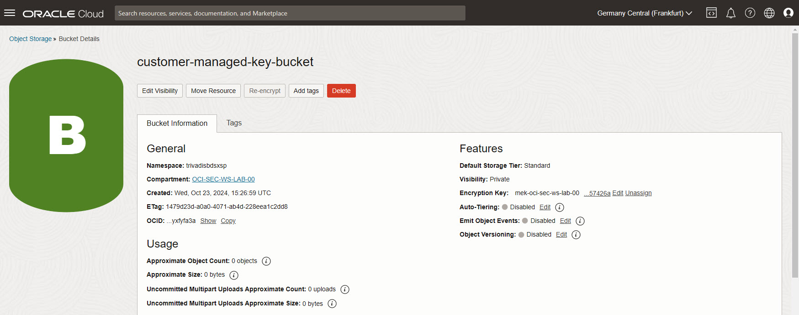
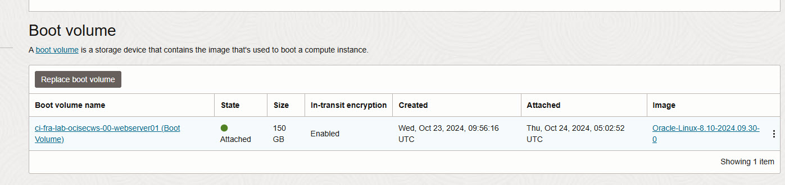
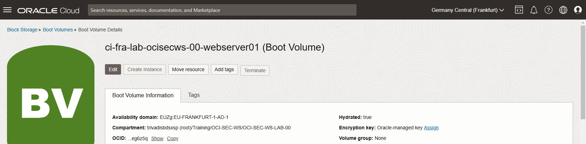
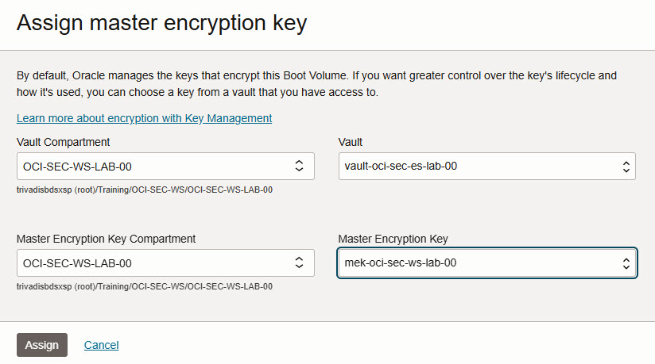

<!-- markdownlint-disable MD013 -->
<!-- markdownlint-disable MD024 -->
<!-- markdownlint-disable MD029 -->
<!-- markdownlint-disable MD033 -->

## Exercise 01: Key Management

In this exercise, we will set up a Vault to store a master encryption key,
allowing us to replace the Oracle-provided key for an Object Storage bucket
with a customer-managed key.

### Objectives

- Create a Vault and generate a master encryption key.
- Apply the master encryption key to a new Object Storage bucket.

## Environment {.unlisted .unnumbered}

Perform this exercise within the following environment:

- **Compartment:** `OCI-SEC-WS-LAB-nn`
- **Region:** Germany Central (Frankfurt)
- **OCI Console URL:** [OCI Console Frankfurt - Login](https://console.eu-frankfurt-1.oraclecloud.com){:target="_blank" rel="noopener"}

Ensure you are in the correct compartment and region. New resources, such as
Cloud Shell configurations and ADB access settings, should be created within
your designated compartment.

## Solution {.unlisted .unnumbered}

Login as User XYZ in OCI console. Ensure you have select the proper compartment
in from the dropdown list on left side.

Identity -> Security -> Key Management & Secret Management -> Vault

### Create Vault and Keys

#### Vault and Master Encryption Key

1. Create a Vault
Do NOT create a PRIVATE VAULT. Set name according compartment name, as example
*vault-oci-sec-ws-lab-00* for compartment *OCI-SEC-WS-LAB-00*.

2. Verify  create Vault is in state Active.

3. Select th created Vault to add a Master Encryption Key. *Create Key*.

4. Select Protection Mode *Software*, use Key Shape: Algorithm and Key Shape:
   Length as per default. *Create Key*. Do not import any external key.

1. Verify Master Encryption Key is in State *Enabled*.

#### Create new Object Storage with MEK

Storage -> Object Storage & Archive Storage -> *Create Bucket*.

Set bucket name, in section *Encryption* now you can select your Master
Encryption Key. Key not visible? Verify compartment and region (Frankfurt).

Verify the key is set, you can edit or unassign it.

#### Create new Object Storage with a Master Encrytion Key

Storage -> Object Storage & Archive Storage -> *Create Bucket*.

Set bucket name, in section *Encryption* now you can select your Master
Encryption Key. Key not visible? Verify compartment and region (Frankfurt).

Verify the key is set, you can edit or unassign it.

#### Change Compute Instance Boot Volume with a Master Encrytion Key

Compute -> Instances -> Webserver 01 (as example: ci-fra-lab-ocisecws-00-webserver01).

Under resources, select the Boot volume name attached to the compute instance.

Assign a new MEK.

Select your created Vault and Master Encrption Key. *Assign*. The Boot Volume
will be updated and the key set.

## Summary {.unlisted .unnumbered}

In this exercise, you:

- Created a Vault to securely store encryption keys.
- Generated a master encryption key within the Vault.
- Applied the master encryption key to a new Object Storage bucket, enabling
  customer-managed encryption.

You are now ready to continue with the next exercise, where you will configure
Cloud Guard for manual remediation of security alerts.

<!-- For Pandoc -->
- **Previous Exercise:** [Exercise 00: Getting Started with OCI](#exercise-00-getting-started-with-oci)
- **Next Exercise:** [Exercise 02: Manual Remediation](#exercise-02-manual-remediation)

<!-- For Jekyll -->
<!-- 
- **Previous Exercise:** [Exercise 00: Getting Started with OCI](../ex00/1x00-Exercise.md)
- **Next Exercise:** [Exercise 02: Manual Remediation](../ex02/2x02-Exercise.md)
-->