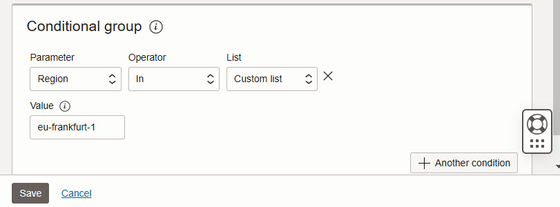

<!-- markdownlint-disable MD024 -->
<!-- markdownlint-disable MD033 -->

# Cloud Guard - Detector and Responder Recipes - Auto Remediation

## Environments {.unlisted .unnumbered}

If not explicitly stated, the exercises are usually performed on the following
environment:

- **Compartment:** OCI-SEC-WS-LAB-nn
- **Region:** Switzerland North (Zurich)
- **OCI Console URL:**
  <a href="https://console.eu-zurich-1.oraclecloud.com" target="_blank" rel="noopener">
  OCI Konsole Zurich - Login</a>

Verify in OCI console you selected the correct region and for Cloud Guard you
are in your compartment. New resources like recipes, object storage buckets etc.,
are always created on your compartment.

## Exercise 02

### Exercise Goals {.unlisted .unnumbered}

We use the detector settings from exercise 01, enable the responder recipe to
auto resolve the problem of a public bucket. If enabled, any public bucket
visibility is changed by Cloud Guard to private automatically.

### Tasks {.unlisted .unnumbered}

- Add Responder recipe to Target
- Enable Auto resolve
- Verify auto resolving by creating an additional bucket and set visibility to
  Public

## Solution

Login as User XYZ in OCI console and go to _Cloud Guard Overview_. Ensure you
have select the proper compartment in from the dropdown list on left side.

### Enable Auto Resolve

#### Add Responder recipe to Target

We must add the responder recipe to target configuration.

Cloud Guard -> Configuration -> Targets

Select your created target an scroll at the bottom.

In section _Configuration_ und _Responder recipes_, add recipe. Select your
responder receive from dropdown list and press _Add recipes_. Do not select the
Oracle managed recipe as you have no privileges there to change any settings.

#### Enable Auto resolve

Select the fresh added Responder recipe. Edit the entry for _Make Bucket Private_
by click on the three dots and _Edit_.

You can ignore the alert about privileges as these settings are done on top
compartment level. We set condition

- In section _Setting_, activated _Execute automatically_.
- Enable checkbox to confirm the execution.
- Set Conditional Group for parameter region to eu-zurich_1

Press _Save_ at the bottom.

#### Verify Auto-Resolve by Creating a Public Bucket

Repeat the steps from the previous lab to create a new bucket.

#### Create Bucket

Add basic information and description. Call it _private_bucket_. Ensure you are
in the correct compartment. If not, select your compartment in left side dropdown
menu.

Press _Create Bucket_.

- Set Bucket Name to _public-bucket_ and let other settings as per default.

Press _Create_ at the bottom.

#### Edit Visibility

Edit created bucket by click on the three dots on bucket line -> Edit Visibility.

Press _Save Changes_ at the bottom.

#### Verification

The bucket is set to public and marked by a yellow triangle.

#### Verify Auto Resolving

After a couple of seconds, you can verify the Responder activity. There are two
new entries to make the bucket private Cloud Guard -> Alerts -> Responder activity

#### Verification

The visibility for your created Object Storage bucket has automatically changed
now to Private.

Storage -> Buckets

