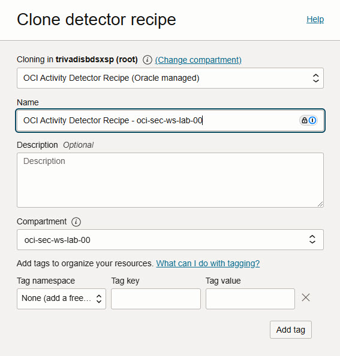

<!-- markdownlint-disable MD013 -->
<!-- markdownlint-disable MD024 -->
<!-- markdownlint-disable MD025 -->
<!-- markdownlint-disable MD033 -->

## Exercise 02: Manual Remediation

In this exercise, we will configure Cloud Guard to detect public Object Storage
buckets by creating a custom detector recipe. You will also set up a target to
monitor your compartment and test the configuration by creating a public bucket.

### Objectives

- Clone an existing Oracle-managed detector recipe.
- Create a new target to monitor objects in your compartment.
- Create an Object Storage bucket and set its visibility to public.
- Verify that Cloud Guard generates an alert for the public bucket.

## Environment {.unlisted .unnumbered}

Perform this exercise within the following environment:

- **Compartment:** `OCI-SEC-WS-LAB-nn`
- **Region:** Germany Central (Frankfurt)
- **OCI Console URL:** [OCI Console Frankfurt - Login](https://console.eu-frankfurt-1.oraclecloud.com){:target="_blank" rel="noopener"}

Ensure you are in the correct compartment and region. New resources, such as
Cloud Shell configurations and ADB access settings, should be created within
your designated compartment.

## Solution {.unlisted .unnumbered}

Login as User XYZ in OCI console and go to _Cloud Guard Overview_. Ensure you
have select the proper compartment in from the dropdown list on left side.

### Clone existing Oracle managed recipes

From left menu, select _Recipes_ and _Clone_.

#### Clone _Detector_ recipes

Cloud Guard -> Recipes -> Detector recipes

- Change compartment on top to trivadisbdsxsp (root).
- Select recipe OCI Activity Detector Recipe (Oracle managed) from dropdown list
- Set name for cloned recipe , as example _OCI Activity Detector Recipe -
  <compartment-name>_
- Ensure in section Compartment, your compartment is selected.

Press _Clone_ at the bottom.

Repeat the steps for the other Oracle managed detector recipes:

- OCI Configuration Detector Recipe (Oracle managed)
- OCI Instance Detector Recipe (Oracle managed)

After successful clone, you have recipes for Instance Security, Configuration
and Activity.

#### Clone _Responder_ recipes

Cloud Guard -> Recipes -> Responder recipes

- Ensure _Responder recipes_ is select from left side menu.
- Change compartment on top to trivadisbdsxsp (root).
- Select recipe OCI Activity Detector Recipe (Oracle managed) from dropdown list
- Set name for cloned recipe , as example _OCI Activity Detector Recipe -
  <compartment-name>_
- Ensure in section Compartment, your compartment is selected.

Press _Clone_ at the bottom.

### Verify cloned recipes

After cloning, you must have three detector recipes and one responder recipes on
your compartment.

Detector recipes:

Responder recipe:

### Create a new target to observer your compartment objects

In this step, we create a target based on compartment and add the recipes we
created.

Cloud Guard -> Configuration -> Targets ->  Create Target

#### Basic Information

Add basic information and description.

- Set target name according compartment, as example _cg-tgt-oci-sec-ws-lab-00_.
- Add description
- Verify compartment is correct according your work compartment.

Press _Next_ at the bottom.

#### Configuration

Add basic information and description.

- In Posture and threat monitoring recipes, select the
  _OCI Configuration Detector Recipe_ you created for your compartment.
- In Instance Security recipe,  select the _OCI Instance Detector Recipe_ you
  created for your compartment.
- Activate _All compute instances_.

Press _Next_ at the bottom.

#### Review

AVerify you select the proper recipes based on your compartment.

Press _Create_ at the bottom. Go back to Cloud Guard Overview page.

### Create a object storage bucket and change visibility to public

In this step, we create am Object Storage bucket and change visibility.

Storage -> Buckets

#### Create Bucket

Add basic information and description. Ensure you are in the correct compartment.
If not, select your compartment in left side dropdown menu.

Press _Create Bucket_.

- Set Bucket Name to _public-bucket_ and let other settings as per default.

Press _Create_ at the bottom.

#### Edit Visibility

Edit created bucket by click on the three dots -> Edit Visibility.

Change visibility to Public. Let checkbox setting as per default.

Press _Save Changes_ at the bottom.

#### Verification

The bucket is set to public and marked by a yellow triangle.

### Verify new Cloud Guard alert

Verify if the public buckets is recognized by Cloud Guard.

Cloud Guard -> Alerts -> Problems

#### Remediation

Select the alert and press _Remediate_.

Ignore the warning ab out missing permissions as your OCI user is not able to
see the policies created on top level.

Confirm.

#### Verification

The visibility for your created Object Storage bucket has changed now to _Private_.

Storage -> Buckets

In Cloud Guard alert view, the state changes after some minutes too.

#### Mark Problem as Resolved

Cloud Guard -> Alerts -> Problems.

Select your problem and -Mark_as_resolved_.

Confirm.

The alert is not longer visible in alert list.

## Summary {.unlisted .unnumbered}

In this exercise, you:

- Cloned an Oracle-managed detector recipe in Cloud Guard.
- Created a new target to observe and monitor resources in your compartment.
- Configured an Object Storage bucket with public visibility.
- Verified that Cloud Guard generated an alert for the public bucket, indicating
  successful detection.

You are now ready to continue with the next exercise, where you will explore
further Cloud Guard configurations.

<!-- For Pandoc -->
- **Previous Exercise:** [Exercise 01: Key Management](#exercise-01-key-management)
- **Next Exercise:** [Exercise 03: Auto Remediation](#exercise-03-auto-remediation)

<!-- For Jekyll -->
<!-- 
- **Previous Exercise:** [Exercise 01: Key Management](../ex01/1x01-Exercise.md)
- **Next Exercise:** [Exercise 03: Auto Remediation](../ex02/2x03-Exercise.md)
-->