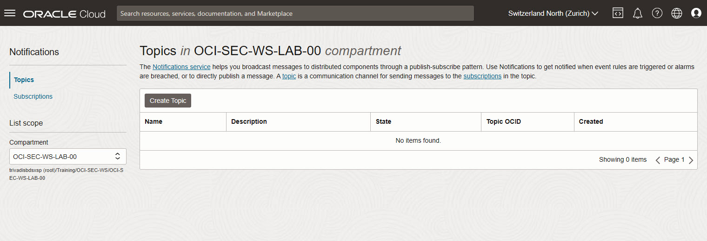
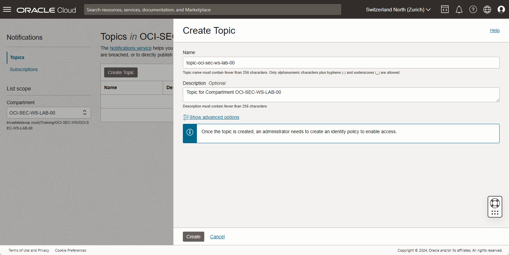
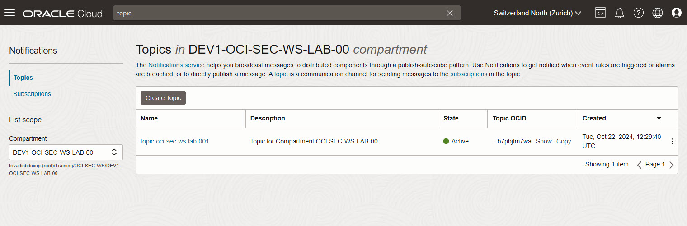
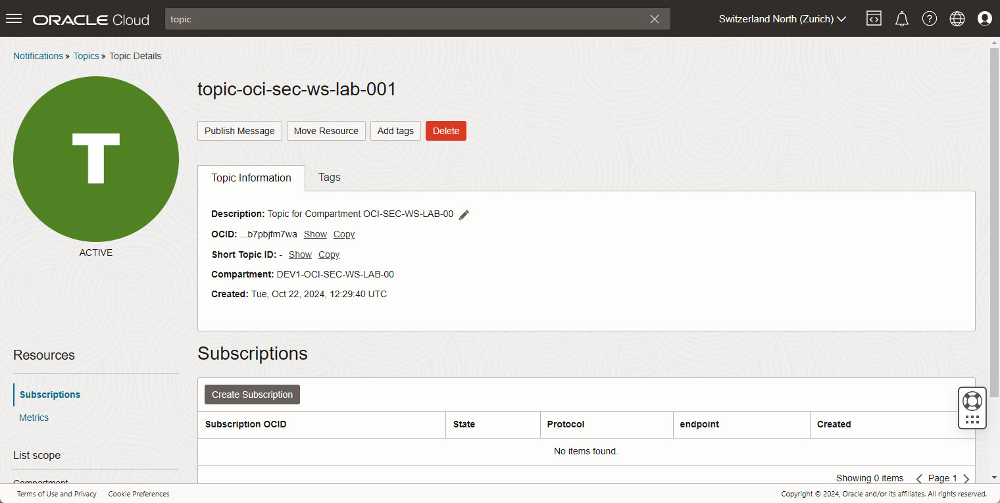
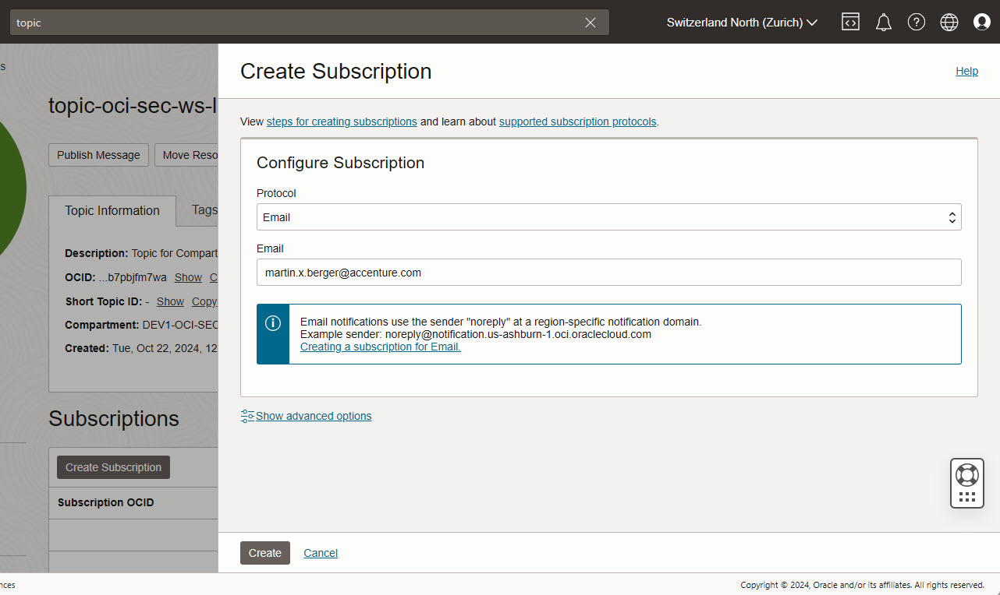
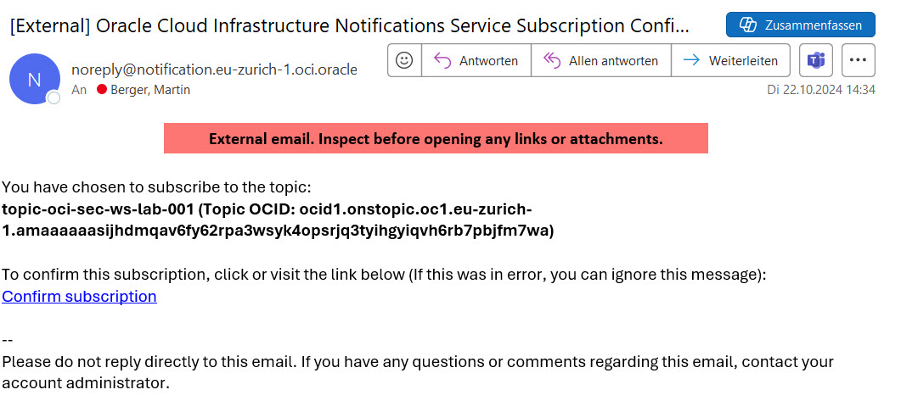
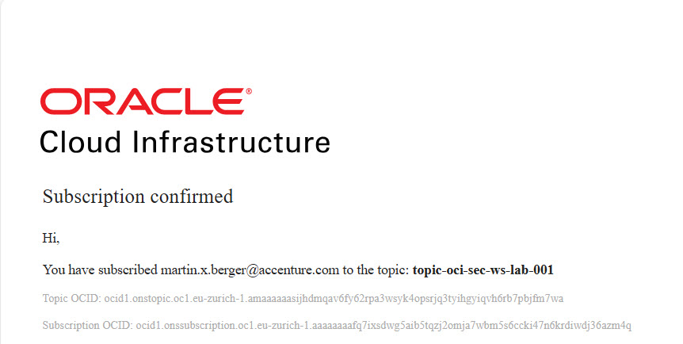
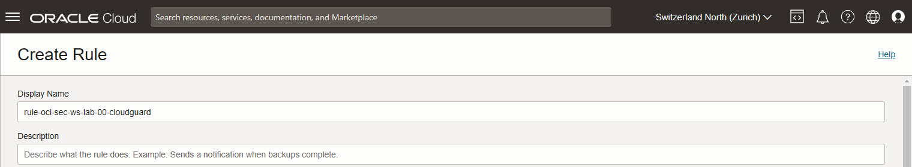
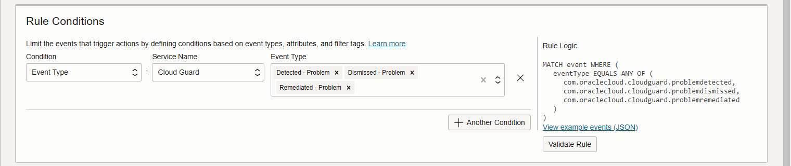

<!-- markdownlint-disable MD013 -->
<!-- markdownlint-disable MD024 -->
<!-- markdownlint-disable MD029 -->
<!-- markdownlint-disable MD033 -->

## Exercise 04: Notification Setup

In this exercise, you will configure notifications in Cloud Guard to receive
alerts about detected security issues. Using the existing detector settings,
you'll set up notifications to be informed of any potential vulnerabilities or
policy violations.

### Objectives

- Create a notification topic and subscription.
- Set up a rule to trigger notifications.
- Test the notification by creating a public Object Storage bucket and verifying
  the alert.

## Environment {.unlisted .unnumbered}

Perform this exercise within the following environment:

- **Compartment:** `OCI-SEC-WS-LAB-nn`
- **Region:** Germany Central (Frankfurt)
- **OCI Console URL:** [OCI Console Frankfurt - Login](https://console.eu-frankfurt-1.oraclecloud.com){:target="_blank" rel="noopener"}

Ensure you are in the correct compartment and region. New resources, such as
Cloud Shell configurations and ADB access settings, should be created within
your designated compartment.

## Solution {.unlisted .unnumbered}

Login as User XYZ in OCI console. Ensure you have select the proper compartment
in from the dropdown list on left side.

>> Overview

### Enable Auto Resolve Notification by Topic

#### Create Topic, Subscription and Confirmation

A topic and a subscription is required to enable the notification service based
on events.

1. Developer Services -> Application Integration -> Notifications -> Create Topic

2. Add details, _Create_.

3. The state of the new created topic is active.

4. View the details, click on topic name. Create a new Subscription: _Create Subscription_.

5. Select:

- Protocol: Email
- Email: add your personal mail address, a mail address where you have immediate
  access for confirmation

Create the subscription and check your inbox.

1. Confirm the subscription

### Create Rule

#### Create Topic, Subscription and Confirmation

We create a rule based on Cloud Guard changes.

Observability & Management -> Events Service -> Rules -> _Create Rule_.

1. Set Display Name and Description, as example _rule-oci-sec-ws-lab-00-cloudguard_.

2. Select Rule Condition.

In section _Rule Conditions_, select _Service Name_ and _Event Type_. Select
these event types:

- Detected - Problem
- Dismissed - Problem
- Remediated - Problem

3. Select Actions

- Action-Type: Notifications
- Notifications-Compartment: OCI-SEC-WS-LAB-<nn> (your compartment name)
- Topic: topic-oci-sec-ws-lab-001 (the topic you created)

## Summary {.unlisted .unnumbered}

In this exercise, you:

- Created a notification topic and subscription for Cloud Guard alerts.
- Configured a rule to send notifications based on specific detector findings.
- Verified the setup by creating a public bucket and receiving the corresponding
  alert.

You are now ready to continue with the next exercise to deepen your understanding
of Data Safe configurations.

- **Previous Exercise:** [Exercise 03: Auto Remediation](#exercise-03-auto-remediation)
- **Next Exercise:** [Exercise 05: Data Safe Configuration and Register ADB](#exercise-05-configuration-and-register-adb)
