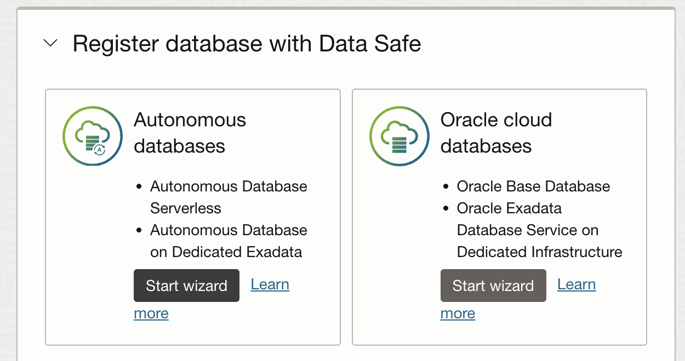
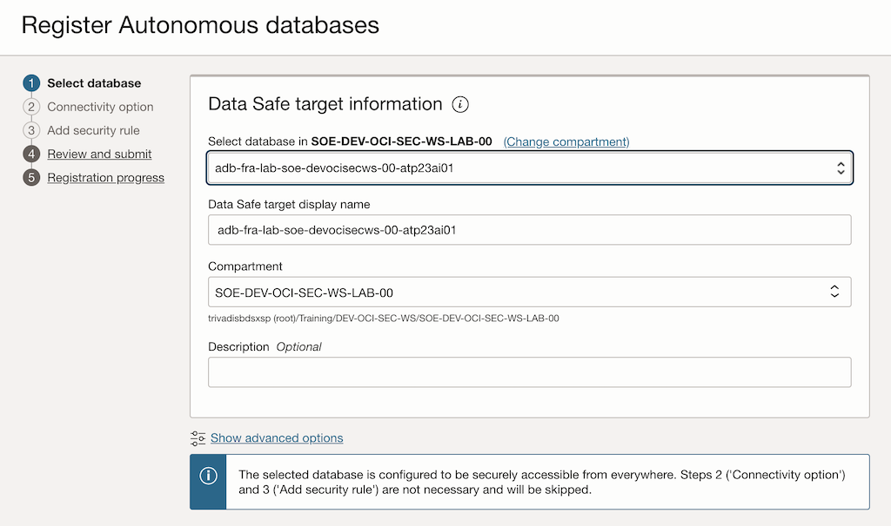
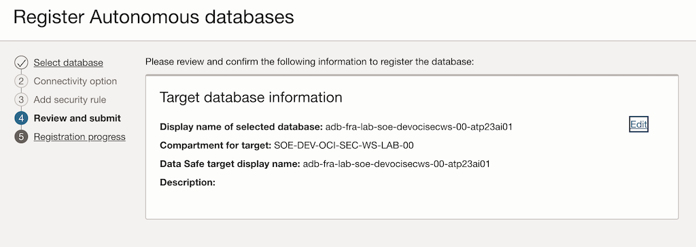
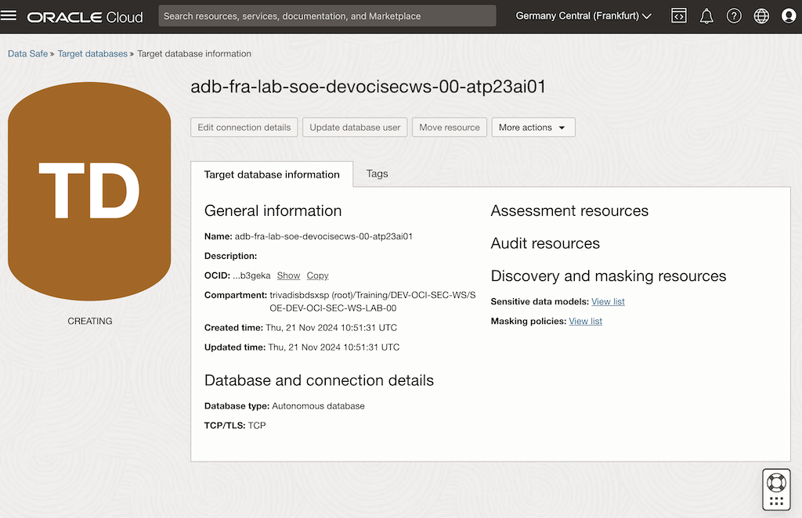
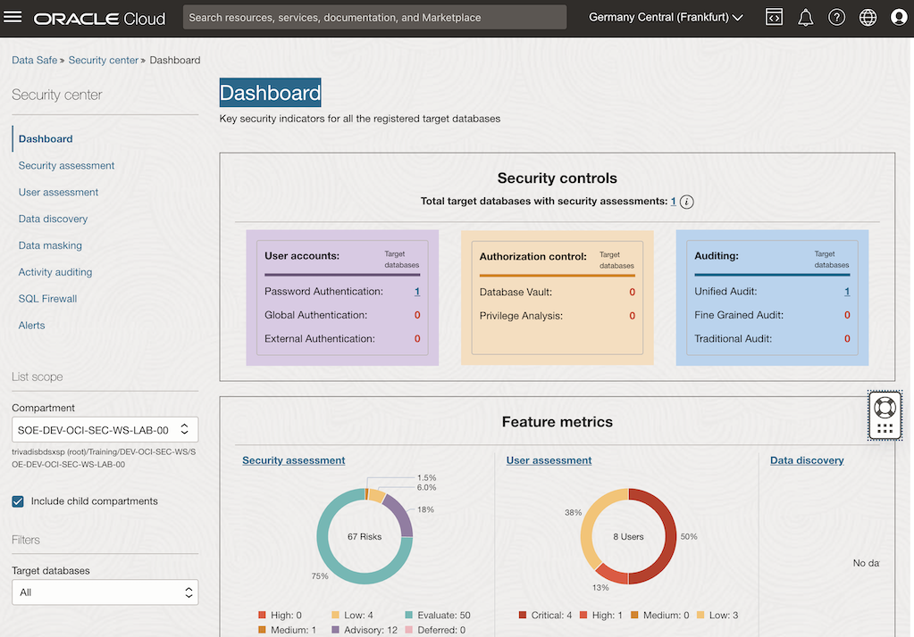

<!-- markdownlint-disable MD013 -->
<!-- markdownlint-disable MD024 -->
<!-- markdownlint-disable MD033 -->
<!-- markdownlint-disable MD041 -->

## Exercise 05: Configuration and Register ADB

In this exercise, you will set up Oracle Data Safe to enhance the security of an Autonomous Database (ADB). This process involves enabling monitoring and data protection features. You will first configure Oracle Data Safe and then register your ADB instance for secure management.

### Objectives

- Set up Oracle Data Safe for your environment.
- Register an Autonomous Database (ADB) to integrate it with Data Safe.

## Environment {.unlisted .unnumbered}

Perform this exercise within the following environment:

- **Compartment:** `OCI-SEC-WS-LAB-nn`
- **Region:** Germany Central (Frankfurt)
- **OCI Console URL:** [OCI Console Frankfurt - Login](https://console.eu-frankfurt-1.oraclecloud.com){:target="_blank" rel="noopener"}
- **OCI User:** *lab-oci-sec-ws**NN***
- **OCI Password:** *provided by trainer*

Ensure you are in the correct compartment and region. New resources, such as Cloud Shell configurations and ADB access settings, should be created within your designated compartment.

## Solution {.unlisted .unnumbered}

Log in to the OCI Console as User XYZ. Ensure you select the correct compartment from the dropdown menu on the left side.

Navigate to:
**Oracle Database -> Data Safe -> Database Security -> Overview**

1. Navigate to the *Autonomous Database* registration wizard within the Data Safe section.

    

2. Select the *Autonomous Database* in your designated compartment, for example, *SOE-DEV-OCI-SEC-WS-LAB-00*.

    

3. Click **Next** to proceed and finalize the registration process.

    

4. The registration process for the *Autonomous Database* may take some time.

    

5. Once the *Autonomous Database* is registered, it will appear in the Data Safe dashboard.

    Navigate to: **Oracle Database -> Data Safe -> Database Security -> Dashboard**

    

## Summary {.unlisted .unnumbered}

In this exercise, you:

- Configured Oracle Data Safe to enable advanced security features for database monitoring and protection.
- Successfully registered an Autonomous Database (ADB) with Data Safe for secure management.

You are now ready to continue with the next exercise, where you will explore how to assess database configurations for compliance and best practices.

<!-- For Pandoc -->
- **Previous Exercise:** [Exercise 04: Notification Setup](#exercise-04-notification-setup)
- **Next Exercise:** [Exercise 06: Assess Database Configurations](#exercise-06-assess-database-configurations)

<!-- For Jekyll -->
<!-- 
- **Previous Exercise:** [Exercise 04: Notification Setup](../ex02/2x04-Exercise.md)
- **Next Exercise:** [Exercise 06: Assess Database Configurations](../ex03/3x06-Exercise.md)
-->
