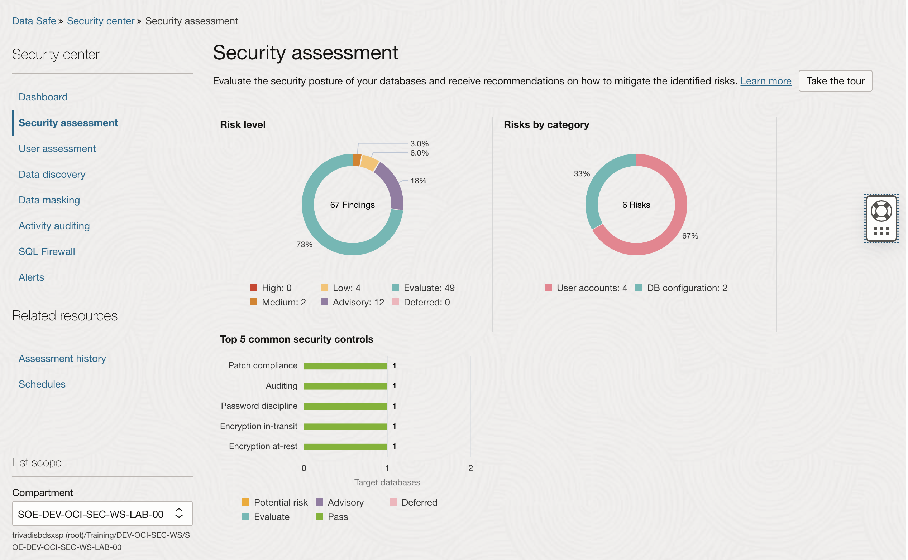

<!-- markdownlint-disable MD013 -->
<!-- markdownlint-disable MD024 -->
<!-- markdownlint-disable MD033 -->
<!-- markdownlint-disable MD041 -->

## Exercise 06: Assess Database Configurations

In this exercise, you will use Oracle Data Safe to perform a configuration
assessment on your Autonomous Database (ADB). This assessment checks the database
settings for compliance with security best practices, helping to identify
potential vulnerabilities and areas for improvement.

### Objectives

- Run a configuration assessment using Oracle Data Safe.
- Identify security risks and areas for improvement based on database settings.

## Environment {.unlisted .unnumbered}

Perform this exercise within the following environment:

- **Compartment:** `OCI-SEC-WS-LAB-nn`
- **Region:** Germany Central (Frankfurt)
- **OCI Console URL:** [OCI Console Frankfurt - Login](https://console.eu-frankfurt-1.oraclecloud.com){:target="_blank" rel="noopener"}

Ensure you are in the correct compartment and region. New resources, such as
Cloud Shell configurations and ADB access settings, should be created within
your designated compartment.

## Solution {.unlisted .unnumbered}

Login as User XYZ in OCI console. Ensure you have select the proper compartment in from the dropdown list on left side.

### Step 1: Explore Security Assessment

Oracle Database -> Data Safe -> Database Security -> Security assessment

### Step 2: Set a Baseline

DOAG24_Schulung

grant read any table on schema sh to public;

Here is the draft solution for **Exercise 06: Assess Database Configurations**, covering the requested steps:

## Solution {.unlisted .unnumbered}

### Step 1: Explore Security Assessment

1. Navigate to the **Oracle Data Safe Dashboard** in the OCI Console.
   - Go to **Data Safe** -> **Security Assessments**.

    

2. Open tab **Target Summary** and select the Security Assessment for your Autonomous Database (ADB).
   - Select the target ADB you registered in the previous exercises.
   - Explore the summary metrics such as:
     - Total findings (e.g., high, medium, low risks).
     - Configuration compliance score.

3. Click on the latest assessment report for the ADB to review the detailed findings.
   - Observe categories such as **user privileges**, **configuration settings**, and **security controls**.
   - Note any highlighted risks or warnings in the findings.

### Step 2: Adjust the Risk Level of a Risk Finding

1. From the **Security Assessment Report**, identify a **risk finding** that you want to adjust.
   - For example: "Default Administrator Account Enabled."

2. Click on the finding to view its details.
   - Note the current **risk level** (e.g., high, medium, or low).

3. Adjust the **risk level**:
   - Click on **Edit Risk** or **Adjust Risk Level**.
   - Select a new risk level (e.g., from "High" to "Medium") and provide a justification for the change (e.g., "Business policy exception").

4. Save the changes.

### Step 3: Set Baseline

1. Go back to the **Security Assessment Dashboard** and select your ADB target.

2. Click on **Set Baseline**:
   - The baseline captures the current configuration and security settings as a reference point.

3. Confirm the baseline creation.
   - This baseline will be used for future comparisons to identify any deviations.

### Step 4: Create a Risk on the Target Database

1. Simulate a security risk by modifying a configuration on the target ADB.
   - For example:
     - Enable a **default user account** (e.g., `HR`) or
     - Alter a **critical parameter** (e.g., disable auditing).

2. Document the change and note how it could introduce a risk to the system.

3. Ensure the change is saved and applied on the target database.

### Step 5: Refresh the Latest Security Assessment and Analyze the Results

1. Navigate back to the **Security Assessments** section in the Data Safe Dashboard.

2. Click **Refresh Assessment**:
   - Wait for the assessment to complete.
   - The new assessment should reflect the risk you introduced in Step 4.

3. Analyze the updated assessment report:
   - Look for the new risk findings created by your changes.
   - Review the affected areas and recommendations provided by Data Safe.

### Step 6: Compare Your Assessment with the Baseline

1. From the Security Assessments page, select the **Baseline Comparison** option.

2. Compare the latest assessment results with the previously set baseline.
   - Identify any deviations or new risks.
   - Note changes such as:
     - Configuration setting differences.
     - Additional risk findings introduced in Step 4.

3. Document the results of the comparison:
   - Highlight any areas of concern that should be addressed.
   - Reset the baseline if the new state is acceptable and reflects the desired configuration.

## Summary {.unlisted .unnumbered}

In this exercise, you:

- Performed a configuration assessment with Oracle Data Safe to evaluate database
  settings.
- Identified potential vulnerabilities and areas to enhance security compliance.

You are now ready to continue with the next exercise, where you will assess
database users to further strengthen your security posture.

<!-- For Pandoc -->
- **Previous Exercise:** [Exercise 05: Data Safe Configuration and Register ADB](#exercise-05-configuration-and-register-adb)
- **Next Exercise:** [Exercise 07: Assess Database Users](#exercise-07-assess-database-users)

<!-- For Jekyll -->
<!-- 
- **Previous Exercise:** [Exercise 05: Data Safe Configuration and Register ADB](../ex03/3x05-Exercise.md)
- **Next Exercise:** [Exercise 07: Assess Database Users](../ex03/3x07-Exercise.md)
-->
