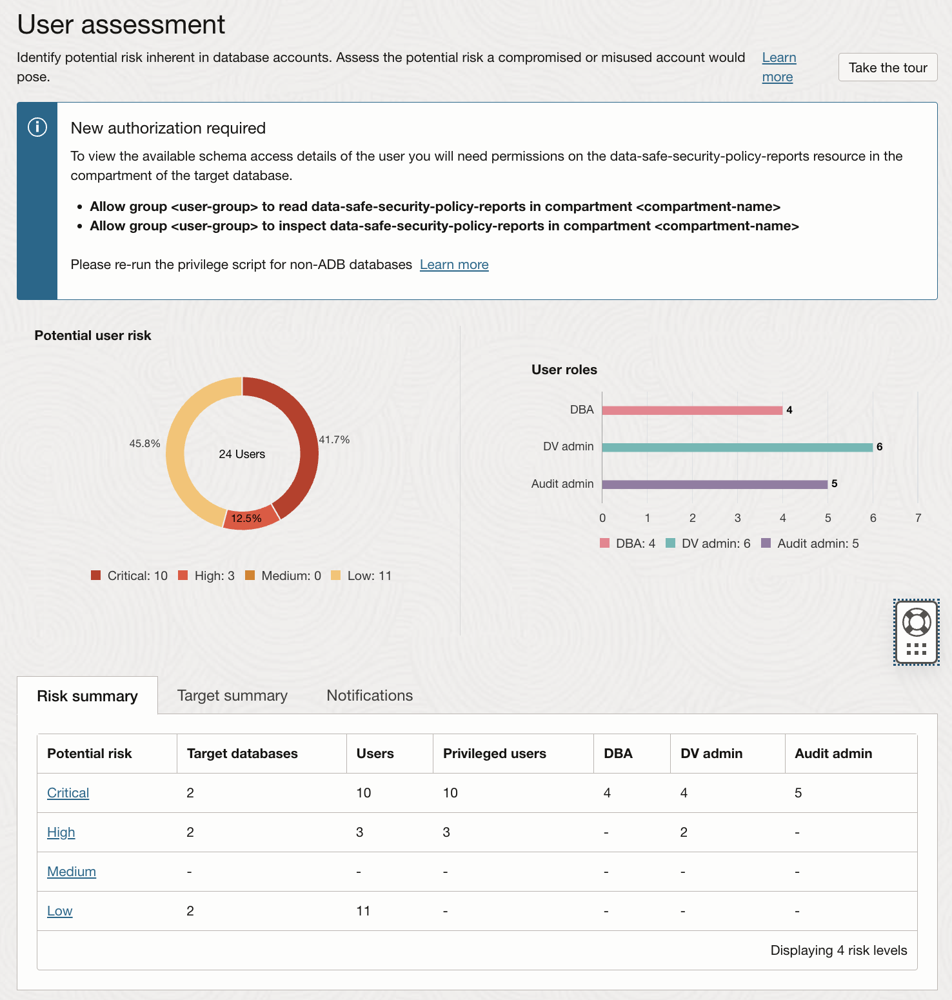
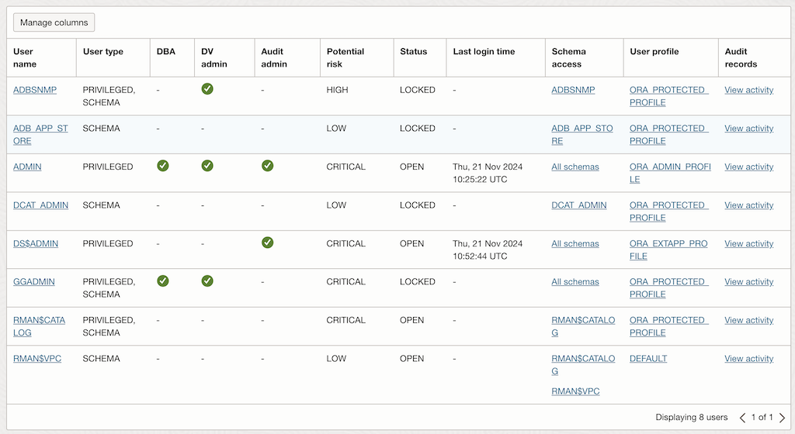
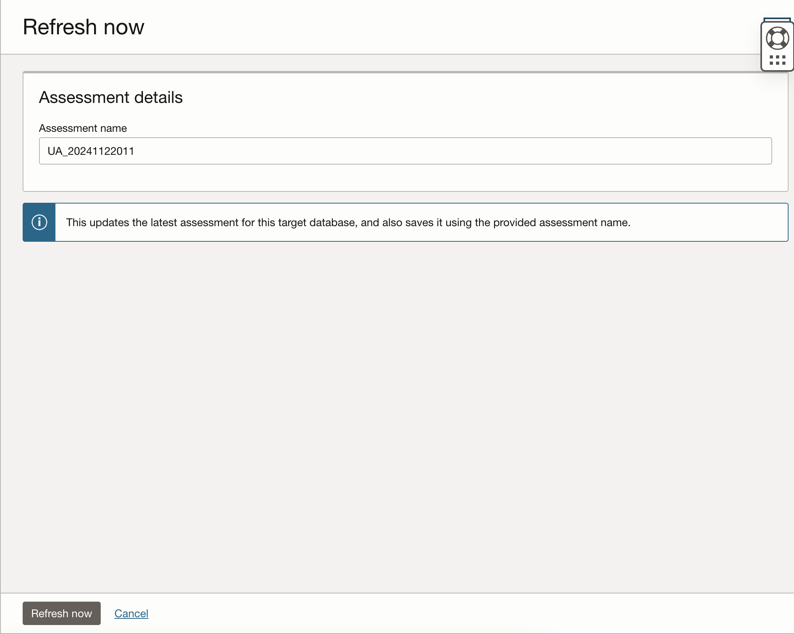
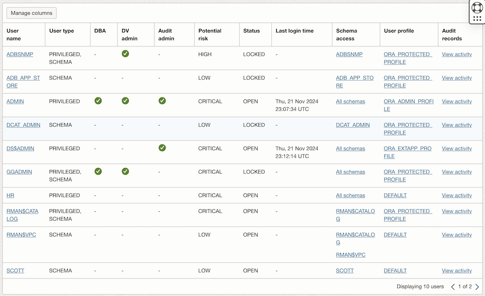

<!-- markdownlint-disable MD013 -->
<!-- markdownlint-disable MD024 -->
<!-- markdownlint-disable MD033 -->
<!-- markdownlint-disable MD041 -->

## Exercise 07: Assess Database Users

In this exercise, you will use Oracle Data Safe to assess user accounts within
your Autonomous Database (ADB). This assessment helps identify user roles,
privileges, and potential security risks associated with database users,
allowing for better security management and compliance.

### Objectives

- Use Oracle Data Safe to assess and analyze database user accounts.
- Identify roles, privileges, and any potential security risks related to
  database users.

## Environment {.unlisted .unnumbered}

Perform this exercise within the following environment:

- **Compartment:** `OCI-SEC-WS-LAB-nn`
- **Region:** Germany Central (Frankfurt)
- **OCI Console URL:** [OCI Console Frankfurt - Login](https://console.eu-frankfurt-1.oraclecloud.com){:target="_blank" rel="noopener"}
- **OCI User:** *lab-oci-sec-ws**NN***
- **OCI Password:** *provided by trainer*

Ensure you are in the correct compartment and region. New resources, such as
Cloud Shell configurations and ADB access settings, should be created within
your designated compartment.

## Solution {.unlisted .unnumbered}

### Step 1: View the Overview Page for User Assessment

1. Navigate to the **Data Safe Dashboard** in the OCI Console.
   - Go to **Data Safe** → **User Assessments**.

2. Select your target Autonomous Database (ADB).

3. View the **User Assessment Overview Page**:
   - Review key metrics, including:
     - Total users.
     - Risk level distribution (e.g., High, Medium, Low).
     - User categories (e.g., Admin Users, Privileged Users).

   

4. Note the summary of potential security risks related to user accounts.

### Step 2: Analyze Users in the Latest User Assessment

1. Open the latest **User Assessment Report** for your target ADB.

2. Review the list of users and their associated risk levels:
   - Focus on users flagged with **High Risk** or **Medium Risk**.

   

3. For each flagged user, analyze the following details:
   - **Privileges**: Review the specific roles and grants assigned to the user.
   - **Login Activity**: Check the last login time and ensure it aligns with expected usage.
   - **Account Status**: Identify users with default passwords, expired passwords, or locked accounts.

### Step 3: Change Users and Entitlements on the Target Database

Either modify your target database via SQL worksheet, Cloud Shell or both.

1. Download and install HR sample schema using cloud shell

   - Download the Sample Schemas

   ```bash
   cd $HOME
   export TNS_ADMIN=$HOME/my_wallet
   git clone https://github.com/oracle/db-sample-schemas.git
   ```

   - Set environment variable to connect to the ADB
  
   ```bash
   export TNS_ADMIN=$HOME/my_wallet
   export ADB_SERVICE=$(grep -o '^[^ ]*tpurgent' $HOME/my_wallet/tnsnames.ora)
   ```

   - Install **human_resources** demo Schema use the default LAB password

   ```bash
   cd $HOME/db-sample-schemas/human_resources
   sql admin@$ADB_SERVICE @hr_install.sql
   ```

2. Access your target database using a SQL worksheet and modify user accounts or privileges to simulate a change:

   - Example 1: Grant an additional role to a user:

     ```sql
     GRANT select any table TO hr;
     ```

   - Example 2: Unlock a user account:

     ```sql
     ALTER USER hr ACCOUNT UNLOCK;
     ```

   - Example 3: Create a new test user with

     ```sql
     CREATE USER test_user NO AUTHENTICATION;
     GRANT CREATE SESSION TO test_user;
     ```

### Step 4: Refresh the Latest User Assessment

1. Navigate back to **User Assessments** in the Data Safe Dashboard.

2. Click **Refresh Assessment** for your target database.
   - Wait for the refresh to complete.

   

3. Review the updated User Assessment Report:
   - Ensure the changes made in Step 3 are reflected.
   - Check for any new findings or risks introduced by the changes.

   

### Step 5: Compare the Latest User Assessment with the Initial User Assessment

1. From the User Assessments page, select the **Comparison assessments** option.

   

2. Compare the latest assessment with the initial assessment:
   - Identify differences in:
     - New users added.
     - Changes in user privileges or roles.
     - Updated risk levels for existing users.

3. Document the comparison results:
   - Highlight any deviations or additional risks introduced by the changes.
   - Evaluate whether corrective actions are needed to mitigate risks.

## Summary {.unlisted .unnumbered}

In this exercise, you:

- Explored the User Assessment overview to review key metrics and user risk distributions.
- Analyzed the users and privileges in the latest user assessment report.
- Simulated changes to users and entitlements on the target database.
- Refreshed the user assessment to capture updates and identify new risks.
- Compared the latest user assessment with the initial assessment to evaluate deviations and ensure compliance.

You are now ready to continue with the next exercise, where you will learn how
to audit database activity to enhance monitoring and security.

<!-- For Pandoc -->
- **Previous Exercise:** [Exercise 06: Assess Database Configurations](#exercise-06-assess-database-configurations)
- **Next Exercise:** [Exercise 08: Audit Database Activity](#exercise-08-audit-database-activity)

<!-- For Jekyll -->
<!-- 
- **Previous Exercise:** [Exercise 06: Assess Database Configurations](../ex03/3x06-Exercise.md)
- **Next Exercise:** [Exercise 08: Audit Database Activity](../ex03/3x08-Exercise.md)
-->
