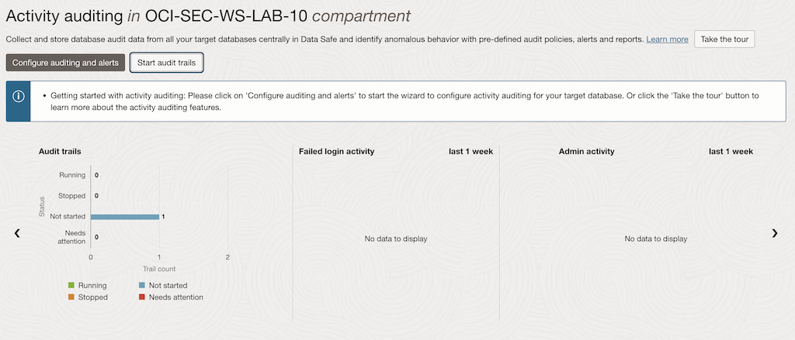
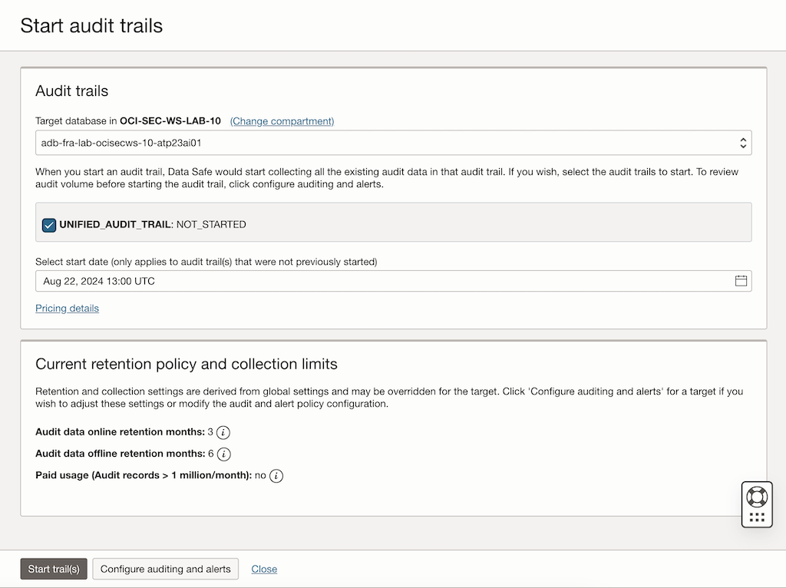
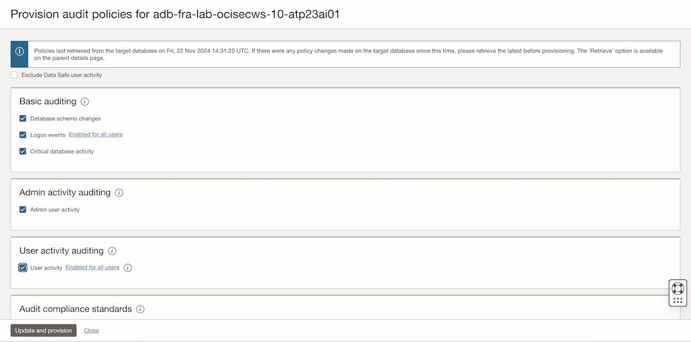
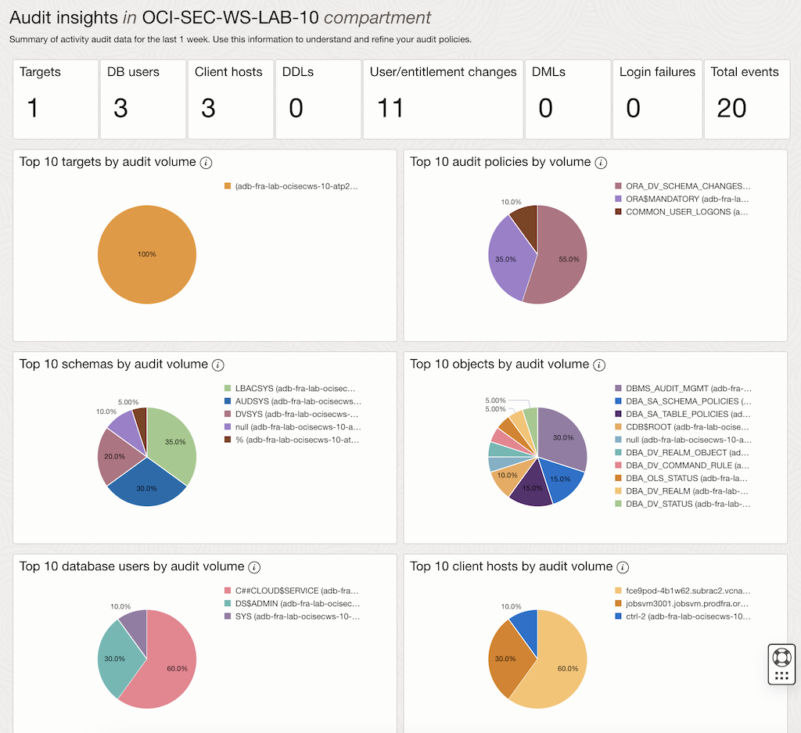
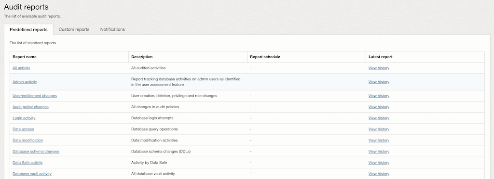

<!-- markdownlint-disable MD013 -->
<!-- markdownlint-disable MD024 -->
<!-- markdownlint-disable MD033 -->
<!-- markdownlint-disable MD041 -->

## Exercise 08: Audit Database Activity

In this exercise, you will use Oracle Data Safe to audit database activity in
your Autonomous Database (ADB). Auditing helps monitor actions performed within
the database, providing insights into user activity and helping detect any
suspicious or unauthorized actions.

### Objectives

- Enable and configure auditing in Oracle Data Safe.
- Review and analyze database activity logs to monitor user actions.

## Environment {.unlisted .unnumbered}

Perform this exercise within the following environment:

- **Compartment:** `OCI-SEC-WS-LAB-nn`
- **Region:** Germany Central (Frankfurt)
- **OCI Console URL:** [OCI Console Frankfurt - Login](https://console.eu-frankfurt-1.oraclecloud.com){:target="_blank" rel="noopener"}
- **OCI User:** *lab-oci-sec-ws**NN***
- **OCI Password:** *provided by trainer*

Ensure you are in the correct compartment and region. New resources, such as
Cloud Shell configurations and ADB access settings, should be created within
your designated compartment.

## Solution {.unlisted .unnumbered}

### Step 1: Enable and Configure Auditing in Oracle Data Safe

1. **Access the Data Safe Dashboard**:
   - Navigate to **Data Safe** -> **Activity Auditing** in the OCI Console.

2. **Enable Auditing for the Target Database**:
   - Select the target Autonomous Database (ADB) from the list.
   - If auditing is not already enabled, follow these steps:
     - Click **Start audit trails**.
     - Confirm that audit data collection is enabled for the selected database.

   

   

3. **Configure Audit Policies**:
   - Go to the **Audit Policies** tab in the Data Safe interface.
   - Select your specific **Autonomous Database**
   - Optionally initiate **Retrieve** to get the latest audit policies from your database
   - Select **Update and provision** to enable specific audit policies for your ADB:
     - **Login/Logout Events**: Tracks user sessions.
     - **Privilege Usage**: Captures the use of system or object privileges.
     - **Data Manipulation (DML)**: Logs INSERT, UPDATE, and DELETE operations.
     - **Schema Changes**: Monitors CREATE, DROP, and ALTER statements.

   

4. **Save the Configuration**:
   - Ensure that the appropriate audit policies are applied to the database for logging key activities.

### Step 2: Review and Analyze Database Activity Logs

1. **Explore Audit Insights**:  
   - Go to **Data Safe** -> **Activity Auditing** -> **Audit Insights**.  
   - Review the top 10 charts displayed.  
   - Drill down into specific audit events for deeper analysis.

   

2. **Access the Audit Reports**:
   - Go to **Data Safe** -> **Activity Auditing** -> **Audit Reports**.
   - Review the *Standard Reports* or create a *Custom Report*

   

3. **Filter Logs by Criteria**:
   - Use the filters to view specific activities, such as:
     - **Time Period**: Specify a date and time range for recent activities.
     - **Users**: Focus on actions performed by specific users.
     - **Events**: Filter for particular event types, such as failed logins or schema changes.

4. **Analyze Audit Logs**:
   - Review details of the audit logs, including:
     - **Event Type**: Type of action performed (e.g., login, DML operations).
     - **User**: Who performed the action.
     - **Timestamp**: When the action occurred.
     - **Object Affected**: Database objects involved in the operation.

5. **Identify Suspicious Activities**:
   - Look for anomalies or risks, such as:
     - Unusual login attempts from unexpected IP addresses.
     - Privilege escalation events.
     - Unauthorized schema changes.

6. **Generate an Audit Report**:
   - Create a custom audit report for your findings:
     - Select specific events and users.
     - Export the report in PDF or CSV format for further analysis.

## Summary {.unlisted .unnumbered}

In this exercise, you:

- Enabled and configured auditing for your Autonomous Database in Oracle Data Safe.
- Applied audit policies to track key database activities, such as logins, privilege usage, and schema changes.
- Reviewed and analyzed database activity logs to monitor user actions and identify potential security risks.

You are now ready to proceed to the next exercise, where you will explore additional Oracle Data Safe features, such as generating alerts and notifications.

<!-- For Pandoc -->
- **Previous Exercise:** [Exercise 07: Assess Database Users](#exercise-07-assess-database-users)
- **Next Exercise:** [Exercise 09: Generate Alerts](#exercise-09-generate-alerts)

<!-- For Jekyll -->
<!-- 
- **Previous Exercise:** [Exercise 07: Assess Database Users](../ex03/3x07-Exercise.md)
- **Next Exercise:** [Exercise 09: Generate Alerts](../ex03/3x09-Exercise.md)
-->
