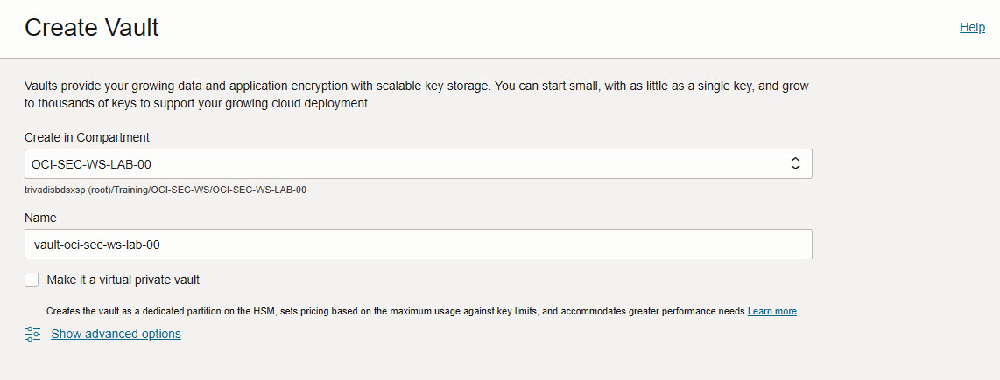
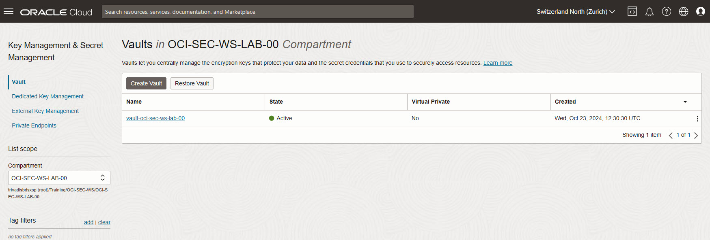
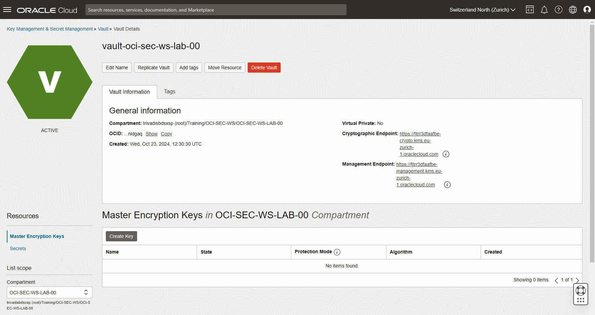
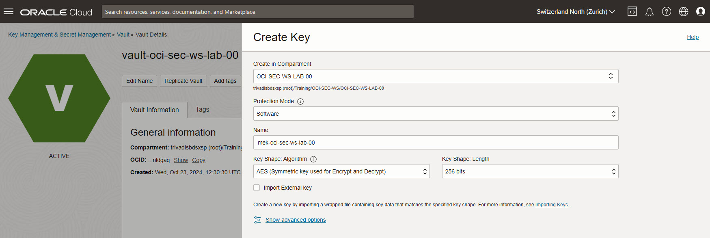
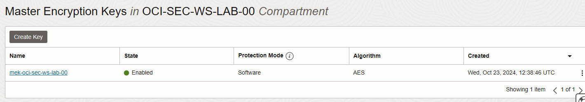
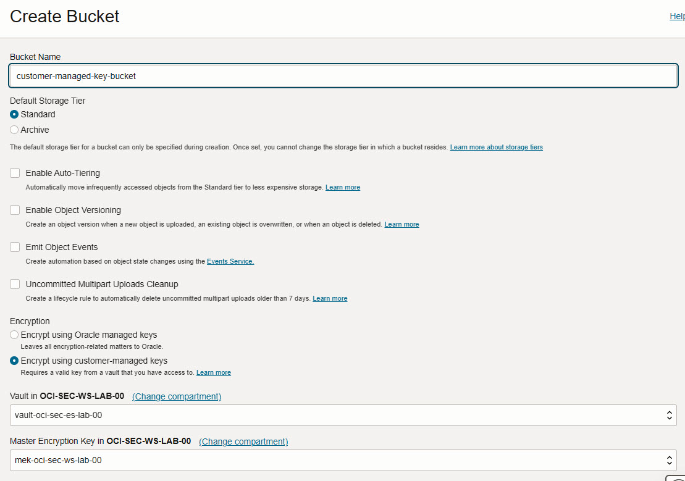
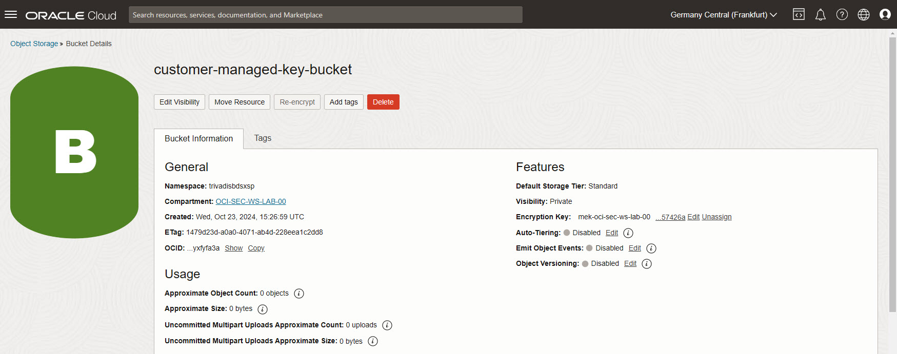
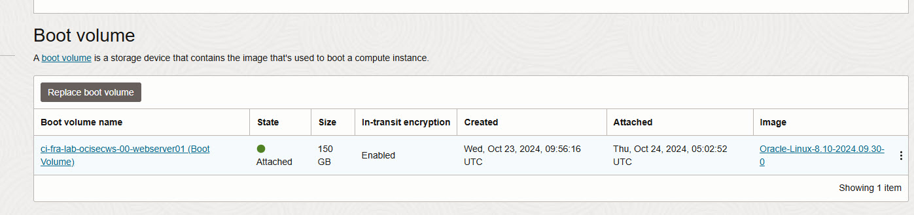
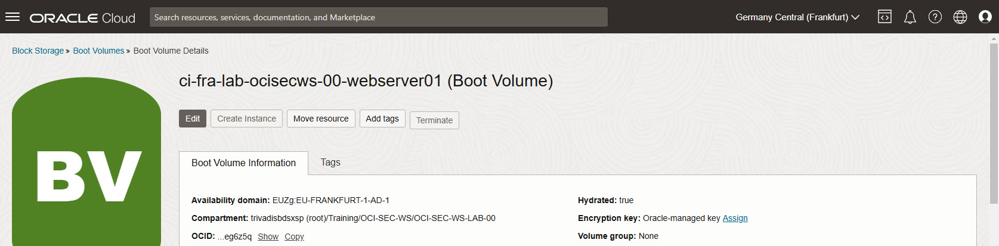
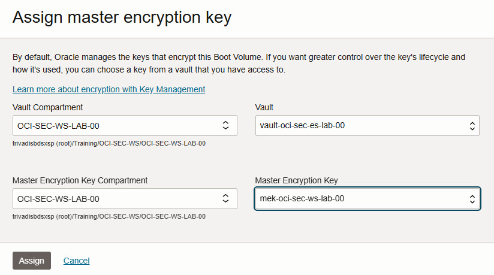

<!-- markdownlint-disable MD024 -->
<!-- markdownlint-disable MD029 -->
<!-- markdownlint-disable MD033 -->

# Key Management
## Environments {.unlisted .unnumbered}

If not explicitly stated, the exercises are usually performed on the following
environment:

- **Compartment:** OCI-SEC-WS-LAB-nn
- **Region:** Germany Central (Frankfurt)
- **OCI Console URL:**
  <a href="https://console.eu-frankfurt-1.oraclecloud.com" target="_blank" rel="noopener">
  OCI Konsole Zurich - Login</a>

Verify in OCI console you selected the correct region and for Vault you are
in your compartment. New resources like recipes, object storage buckets etc.,
are always created on your compartment.

## Exercise 02

### Exercise Goals {.unlisted .unnumbered}

We create a Vault to store a Mater encryption key to change the Oracle provide key on Object storage object to a Customer Manage Key.

### Tasks {.unlisted .unnumbered}

- Create Vault and Master Encryption Key
- Use Master Encryption Key for new Object Storage bucket

## Solution

Login as User XYZ in OCI console. Ensure you have select the proper compartment
in from the dropdown list on left side.

Identity -> Security -> Key Management & Secret Management -> Vault

### Create Vault and Keys

#### Vault and Master Encryption Key

1. Create a Vault
Do NOT create a PRIVATE VAULT. Set name according compartment name, as example vault-oci-sec-ws-lab-00 for compartment OCI-SEC-WS-LAB-00.

2. Verify  create Vault is in state Active.

3. Select th created Vault to add a Master Encryption Key. _Create Key_.

4. Select Protection Mode _Software_, use Key Shape: Algorithm and Key Shape: Length as per default. _Create Key_. Do not import any external key.

5. Verify Master Encryption Key is in State _Enabled_.

#### Create new Object Storage with MEK

Storage -> Object Storage & Archive Storage -> _Create Bucket_.

Set bucket name, in section _Encryption_ now you can select your Master Encryption Key. Key not visible? Verify compartment and region (Frankfurt).

Verify the key is set, you can edit or unassign it.

#### Create new Object Storage with a Master Encrytion Key

Storage -> Object Storage & Archive Storage -> _Create Bucket_.

Set bucket name, in section _Encryption_ now you can select your Master Encryption Key. Key not visible? Verify compartment and region (Frankfurt).

Verify the key is set, you can edit or unassign it.

#### Change Compute Instance Boot Volume with a Master Encrytion Key

Compute -> Instances -> Webserver 01 (as example: ci-fra-lab-ocisecws-00-webserver01).

Under resources, select the Boot volume name attached to the compute instance.

Assign a new MEK.

Select your created Vault and Master Encrption Key. _Assign_. The Boot Volume will be updated and the key set.

