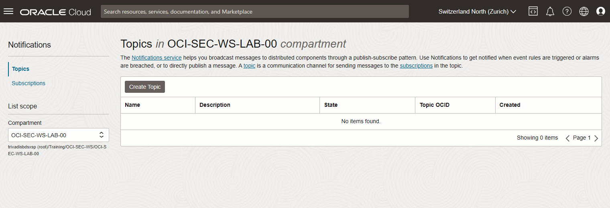
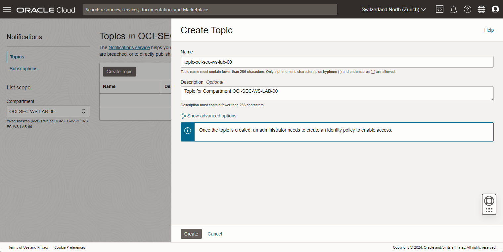
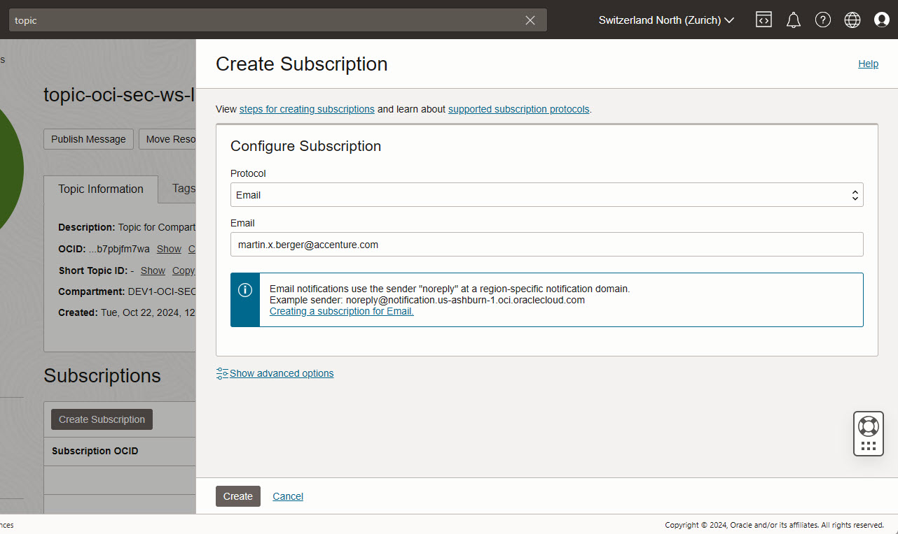
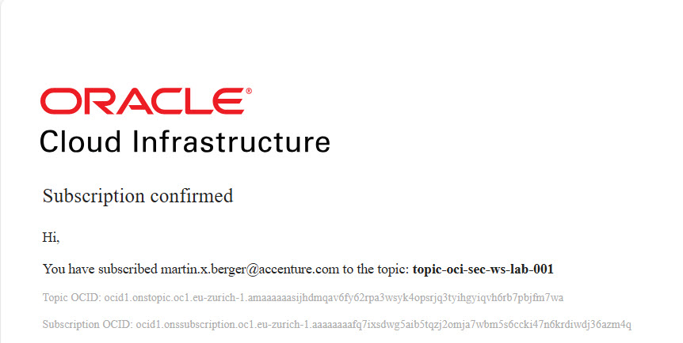
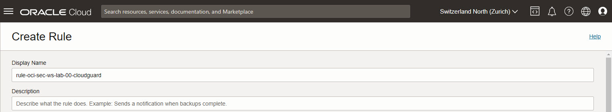
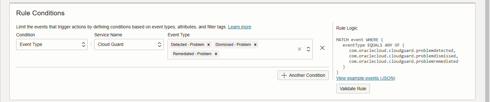

<!-- markdownlint-disable MD024 -->
<!-- markdownlint-disable MD025 -->
<!-- markdownlint-disable MD029 -->
<!-- markdownlint-disable MD033 -->

# Cloud Guard - Detector and Responder Recipes - Notification

## Environments {.unlisted .unnumbered}

If not explicitly stated, the exercises are usually performed on the following
environment:

- **Compartment:** OCI-SEC-WS-LAB-nn
- **Region:** Germany Central (Frankfurt)
- **OCI Console URL:**
  <a href="https://console.eu-frankfurt-1.oraclecloud.com" target="_blank" rel="noopener">
  OCI Console Frankfurt - Login</a>

Verify in OCI console you selected the correct region and for Cloud Guard you are
in your compartment. New resources like recipes, object storage buckets etc.,
are always created on your compartment.

## Exercise 02

### Exercise Goals {.unlisted .unnumbered}

Based on the detector settings, we configure the notification to be informed
about any issues.

### Tasks {.unlisted .unnumbered}

- Create Topic, and Subscription
- Create Rule
- Verify with a Public Bucket the behavior

## Solution

Login as User XYZ in OCI console. Ensure you have select the proper compartment
in from the dropdown list on left side.

>> Overview

### Enable Auto Resolve Notification by Topic

#### Create Topic, Subscription and Confirmation

A topic and a subscription is required to enable the notification service based
on events.

1. Developer Services -> Application Integration -> Notifications -> Create Topic

2. Add details, _Create_.

3. The state of the new created topic is active.

4. View the details, click on topic name. Create a new Subscription: _Create Subscription_.

5. Select:

- Protocol: Email
- Email: add your personal mail address, a mail address where you have immediate
  access for confirmation

Create the subscription and check your inbox.

1. Confirm the subscription

### Create Rule

#### Create Topic, Subscription and Confirmation

We create a rule based on Cloud Guard changes.

Observability & Management -> Events Service -> Rules -> _Create Rule_.

1. Set Display Name and Description, as example _rule-oci-sec-ws-lab-00-cloudguard_.

2. Select Rule Condition.

In section _Rule Conditions_, select _Service Name_ and _Event Type_. Select
these event types:

- Detected - Problem
- Dismissed - Problem
- Remediated - Problem

3. Select Actions

- Action-Type: Notifications
- Notifications-Compartment: OCI-SEC-WS-LAB-<nn> (your compartment name)
- Topic: topic-oci-sec-ws-lab-001 (the topic you created)
