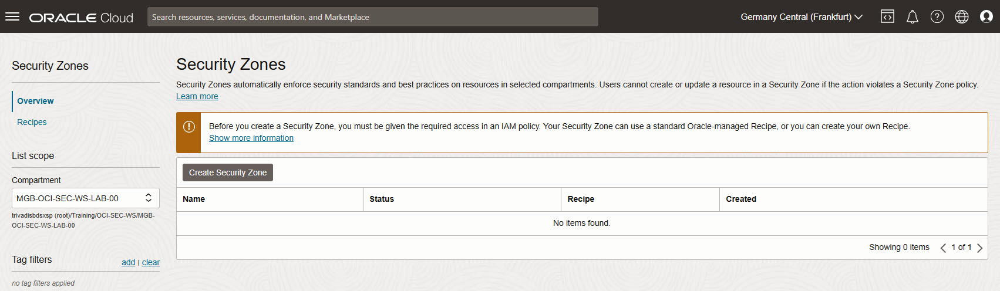
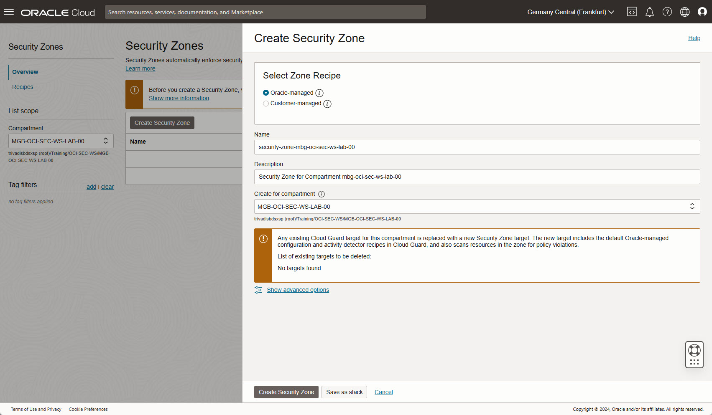
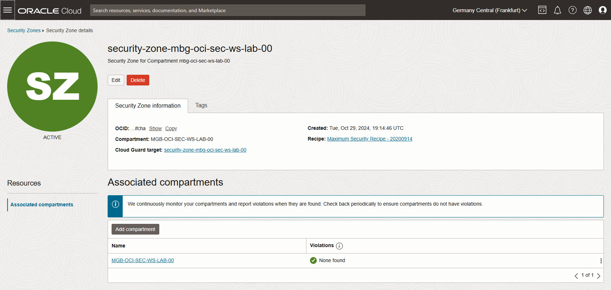
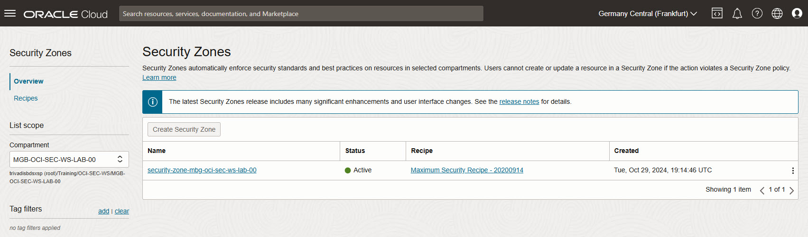
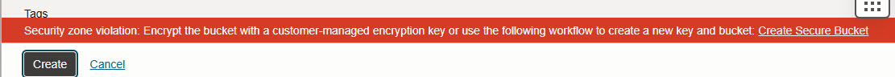
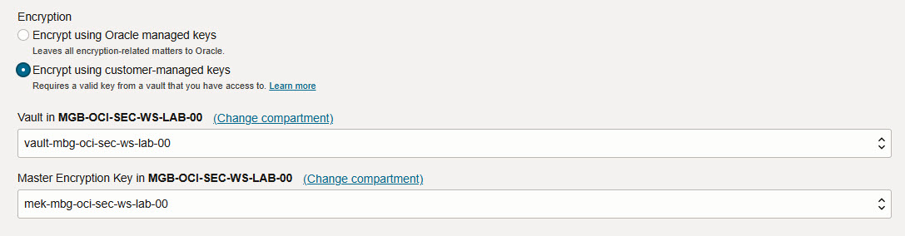
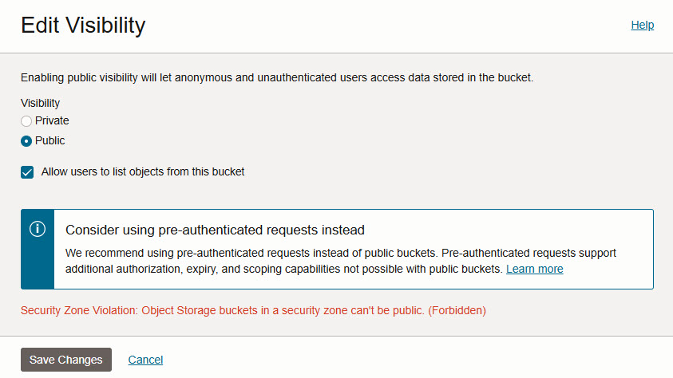
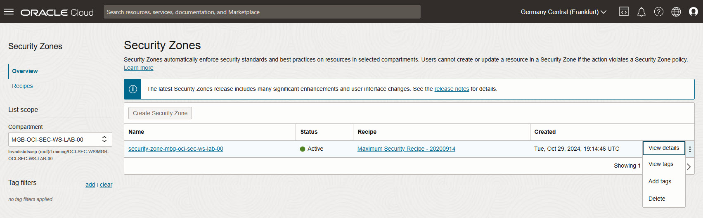
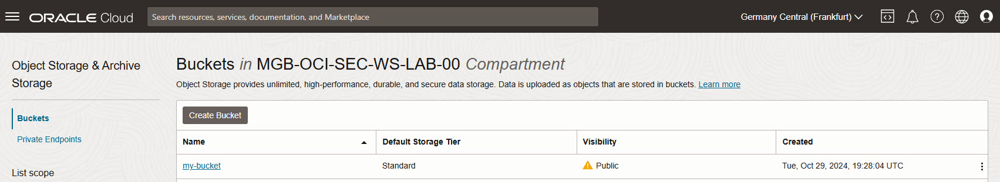

<!-- markdownlint-disable MD013 -->
<!-- markdownlint-disable MD024 -->
<!-- markdownlint-disable MD033 -->
<!-- markdownlint-disable MD041 -->

## Exercise 12: Create Security Zone

In this exercise, you will create a Security Zone in Oracle Cloud Infrastructure
(OCI) to enforce security policies and explore the restrictions applied to
resources created within the zone.

### Objectives

- Set up a Security Zone in OCI.
- Test the Security Zone by creating an Object Storage bucket to observe
  enforced limitations.

## Environment {.unlisted .unnumbered}

Perform this exercise within the following environment:

- **Compartment:** `OCI-SEC-WS-LAB-nn`
- **Region:** Germany Central (Frankfurt)
- **OCI Console URL:** [OCI Console Frankfurt - Login](https://console.eu-frankfurt-1.oraclecloud.com){:target="_blank" rel="noopener"}

Ensure you are in the correct compartment and region. New resources, such as
Cloud Shell configurations and ADB access settings, should be created within
your designated compartment.

## Solution {.unlisted .unnumbered}

Login as User XYZ in OCI console and go to _Security & Identity_ ->
_Security Zones_. Ensure you have select the proper compartment in from the
dropdown list on left side.

### Create Security Zone

In dashboard, _Create Security Zone_.

Name the resource, as example in style: security-zone-<compartment name>. As
example: security-zone-mbg-oci-sec-ws-lab-00. Add a description and click on
_Create Security Zone_.

Verify the new associated compartment.

In _Security Zones_ -> _Recipes_, verify the associated Maximum Security Recipe

- 20200914

### Create an Object Storage bucket

Ensure you have select the proper compartment in from the dropdown list on left
side to create a new Object Storage bucket. Verify the error.

Change  and use the _Customer Managed Key_ from exercise 01, as example my key
called_mek-mbg-oci-sec-ws-lab-00_.

Try to change visibility from the new created bucket to public. Verify the error
message.

### Delete Security Zone

In _Security & Identity_ -> _Security Zones_, select your security zone and
delete it.

### Create a Public Object Storage

In Object Storage menu, change the visibility of created Object Storage bucket
to _PUBLIC_. Verify the visibility - a yello triangle occurs.

### Create Security Zone again

We repeat step 1, and create again the security zone in out compartment. Verify
the Violations after successful creation. Is the public bucket detected? If not,
grab a coffee and come back in a few minutes.

>> step_10

## Summary {.unlisted .unnumbered}

In this exercise, you:

- Created a Security Zone to enforce OCI security policies.
- Attempted to create an Object Storage bucket within the Security Zone,
  observing any restrictions and limitations.

You are now ready to continue with the next exercise, where you will configure
and test the Web Application Firewall (WAF) for enhanced application security.

<!-- For Pandoc -->
- **Previous Exercise:** [Exercise 11: SQL Firewall](#exercise-11-sql-firewall)
- **Next Exercise:** [Exercise 13: Web Application Firewall (WAF)](#exercise-13-setup-waf-for-xss-detection)

<!-- For Jekyll -->
<!-- 
- **Previous Exercise:** [Exercise 11: SQL Firewall](../ex03/3x11-Exercise.md)
- **Next Exercise:** [Exercise 13: Web Application Firewall (WAF)](../ex04/4x13-Exercise.md)
-->
