<!-- markdownlint-disable MD013 -->
<!-- markdownlint-disable MD024 -->
<!-- markdownlint-disable MD033 -->
<!-- markdownlint-disable MD041 -->

## Exercise 13: Setup WAF for XSS Detection

In this exercise, you will configure a Web Application Firewall (WAF) in Oracle
Cloud Infrastructure (OCI) to detect cross-site scripting (XSS) attacks. You
will set up a Load Balancer and WAF to protect an HTTP server running on compute
instances in a private network.

### Objectives

- Configure Cloud Shell for access to the private network.
- Install an HTTP server on compute instances.
- Set up a public Load Balancer.
- Configure the Web Application Firewall (WAF).
- Test the WAF configuration to verify XSS detection.

## Environment {.unlisted .unnumbered}

Perform this exercise within the following environment:

- **Compartment:** `OCI-SEC-WS-LAB-nn`
- **Region:** Germany Central (Frankfurt)
- **OCI Console URL:** [OCI Console Frankfurt - Login](https://console.eu-frankfurt-1.oraclecloud.com){:target="_blank" rel="noopener"}
- **OCI User:** *lab-oci-sec-ws**NN***
- **OCI Password:** *provided by trainer*

Ensure you are in the correct compartment and region. New resources, such as
Cloud Shell configurations and ADB access settings, should be created within
your designated compartment.

## Solution {.unlisted .unnumbered}

Login as User XYZ in OCI console. Ensure you have select the proper compartment
in from the dropdown list on left side.

### Setup Cloud Shell for private Network

In *Compute* -> *Instances*, note down the two private IP addresses of the
compute instances. As example 10.0.0.75 and 10.0.0.76.


On top of OCI Console, verify region is Germany Central (Frankfurt), open a
Cloud Shell. Enusre private network from exercise 01 is activated.

In Cloud Shell, create a new directory and download Private SSH Key from OCI
object storage.

```BASH
-- create directory
mkdir ssh
cd ssh

--get key 
wget https://objectstorage.eu-frankfurt-1.oraclecloud.com/p/Dec-iebNrGgpe_KhXMkugnekpAOQHl-jAUGJMlgpqngKmSP8iqMKdLXu8hT0Wsru/n/trivadisbdsxsp/b/DOAG-2024/o/id_rsa

-- set permissions
chmod 600 id_rsa
```

### Install http Server on Compute Instances

Login in first compute instance webserver as user opc. Use the private key from
above to connect.

```BASH
--login as user opc
cd $HOME/ssh
ssh -i id_rsa opc@10.0.0.75
```

```BASH
--http / php package installation
$ sudo dnf install httpd php -y
--start apache and php module
$ sudo apachectl start
$ sudo systemctl start php-fpm
--enable for server restart
$ sudo systemctl enable httpd
$ sudo systemctl enable php-fpm
--verify apache is running on port 80
$ sudo netstat -tulnp | grep http
--enable firewall
$ sudo firewall-cmd --permanent --zone=public --add-service=http
$ sudo firewall-cmd --reload
```

Create HTML Index Page and XSS PHP Page in /var/www/html

```BASH
--create index.php file
$ sudo vi /var/www/html/index.php

--copy & paste the lines below to file

<?php
echo "OCI Hostname: " . gethostname();
?>
```

Save and close the file with

- esc
- :
- wq
sequence.

```BASH
--create xss demo file
$ sudo vi /var/www/html/xss_demo.php

--copy & paste the lines below to file

<!DOCTYPE html>
<html lang="en">
<head>
   <meta charset="UTF-8">
   <title>XSS Demo</title>
</head>
<body>
   <h1>XSS Demo Page</h1>
   <form action="" method="get">
       <label for="name">Enter your name:</label>
       <input type="text" id="name" name="name">
       <input type="submit" value="Submit">
   </form> 
   <?php
   if (isset($_GET['name'])) {
       $name = $_GET['name'];
       // This directly outputs user input without
       // sanitization, making it vulnerable to XSS
       echo "<p>Hello, $name</p>";
   }
   ?>
</body>
</html>
```

Save and close the file with

- esc
- :
- wq
sequence.

Test running webserver. This command returns the hostname.

```BASH
curl http://localhost
```

Repeat the steps for second webserver.

### Setup Public Load Balancer

Create a Public Load Balancer in Public Subnet with the two webservers as
backend, attention: health check must set to http (as https as per default).
Verify that backend checks run to green (ok) after a while.

Networking -> Load Balancer -> Create Load Balancer


Add details:

- set name
- let visibility type as PUBLIC


Scroll down and set:

- Virtual Cloud network
- Your public subnet

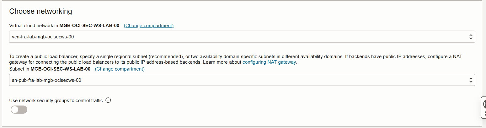

*Next*.

Choose backends:

- select backend servers and add your compute instances

Select your two webserver and add them to the list. Let port as is. Do ot change
other settings.


*Next*.

Configure listener:

- Change type of traffic type to HTTP. Do not change other settings.Port is automatically changed to 80 now.

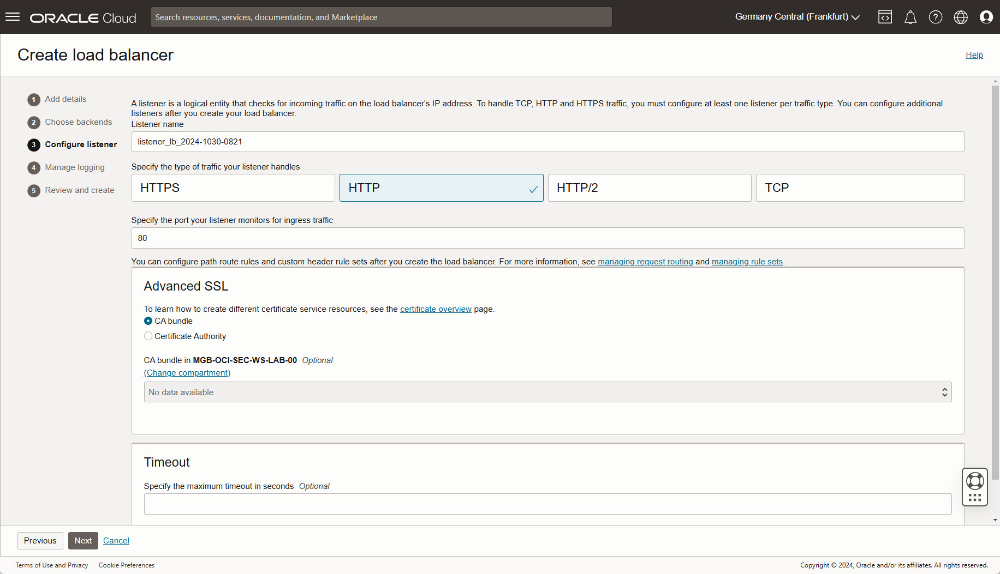

*Next*.

Manage Logging:

- Do not change settings.
- Verify your compartment is selected in dropdown list

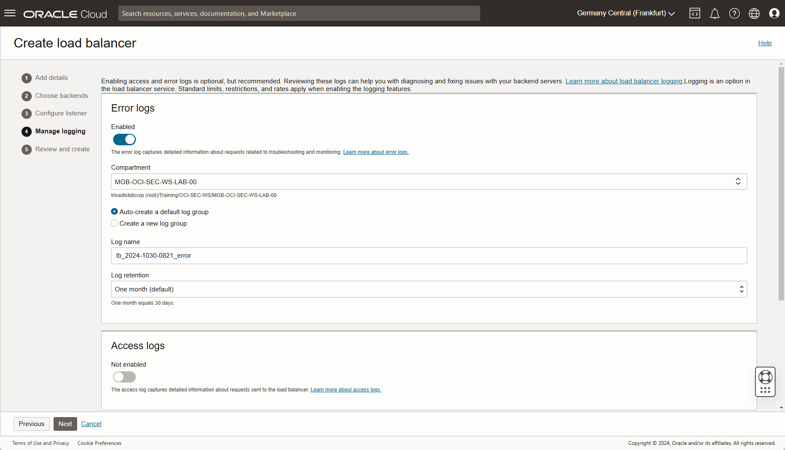

*Next*.

Review and create:

- verify settings


*Submit*.

The load balancer is created, wait until completed. Now you can see the load
balancer public IP in overview in section Load balancer information. The overall
health changes to ok.

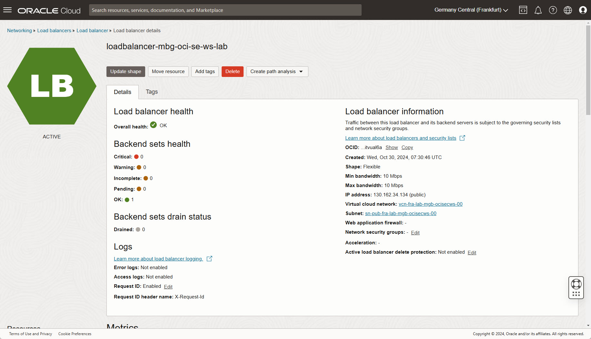

Verify reachability in a new web browser window - URL:
<http://your> public load balancer ip/index.php. Whenever the browser is refreshed, the webserver changes from webserver01 to webserver02 and vice versa.

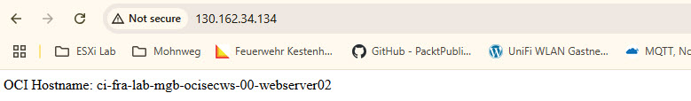

Same when using xss_demo.php as target URL: <http://your> public load balancer ip/xss_demo-php.

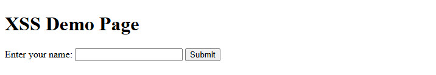

Test XSS-Injection by type in text box: <script>alert('XSS');</script> - or use
the direct URL , as example <http://129.159.106.151/xss_demo.php?name=><script>alert('XSS');</script>.

A popup-window occurs. If there is no window, two possible reasons for:

- company network where such URLs are blocked by DNS
- popup-blocker enabled

 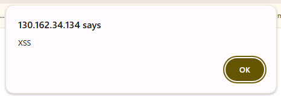

### Setup Web Application Firewall

 *Identity & Security* -> *Web Application Firewall* -> *Create WAF policy*.

 Basic information: Set a name, do not change the actions.

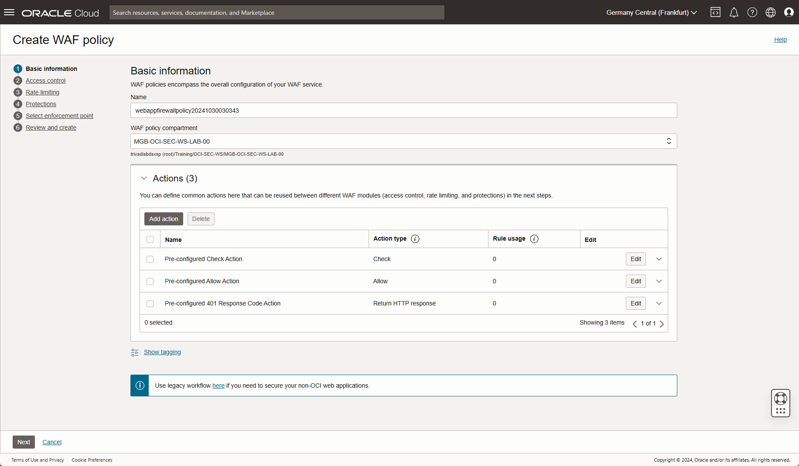

 *Next*.

 Access control: Do NOT enable the checkbox.

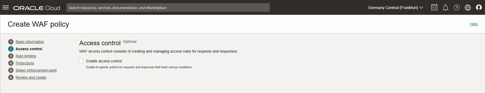

 *Next*.

 Rate limiting: Do NOT enable the checkbox.

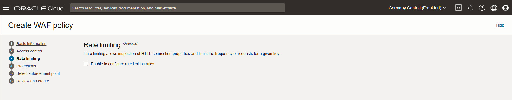

 *Next*.

 Protections: Enable checkbox and *Add request protection rule*.


Set a name for the rule, as action name select
*Pre-configured 401 Response Code Action*.

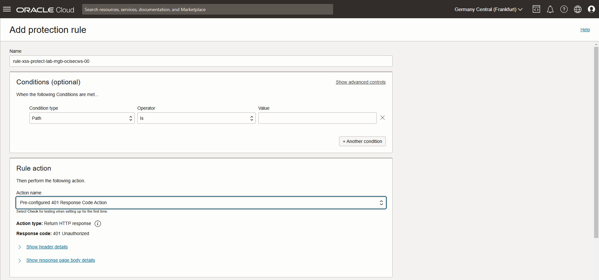

Scroll down to section *Protection capabilities*, click on
*Choose protection capabilities* to add XSS components.

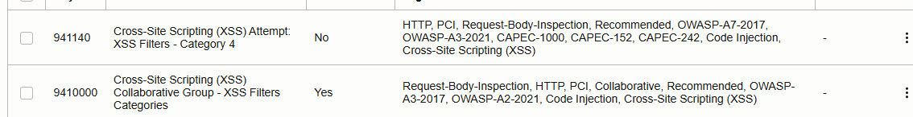

Click on button *Add request protection rule* at the bottom to add selected rule
action and protection capabilities.

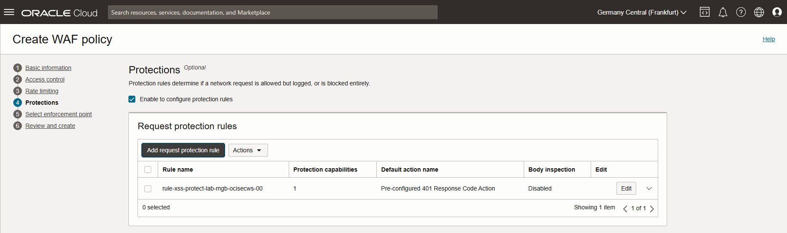

 *Next*.

Select enforcement point: select Load Balancer created above.

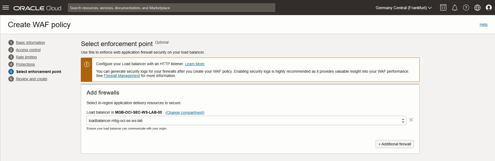

 *Next*.

Review and create: click on *Create WAF policy*. Wait a moment until policy and
firewall rule are created.


### Verify WAF

Open web browser with URL http://<your public load balancer ip>/xss_demo-php.
Enter the code snippet into the text box nd click on *Submit*.

```HTML
<script>alert('XSS');</script>
```

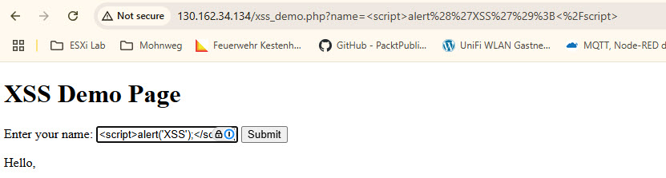

An error occurs.

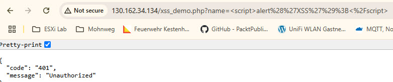

Optional:

- try to change error message with a own text

## Summary {.unlisted .unnumbered}

In this exercise, you:

- Configured Cloud Shell to connect to the private network.
- Installed an HTTP server on compute instances.
- Set up a public Load Balancer to route traffic.
- Configured a Web Application Firewall (WAF) to detect and block XSS attacks.
- Verified that the WAF successfully detected XSS attempts.

You have now completed the WAF setup and are ready to continue exploring other
security features in OCI.

<!-- For Pandoc -->
- **Previous Exercise:** [Exercise 12: Create Security Zone](#exercise-12-create-security-zone)
- **Next Exercise:** [Workshop Overview](#workshop-overview)

<!-- For Jekyll -->
<!-- 
- **Previous Exercise:** [Exercise 12: Create Security Zone](../ex04/4x12-Exercise.md)
- **Next Exercise:** [Workshop Overview](../README.md)
-->
