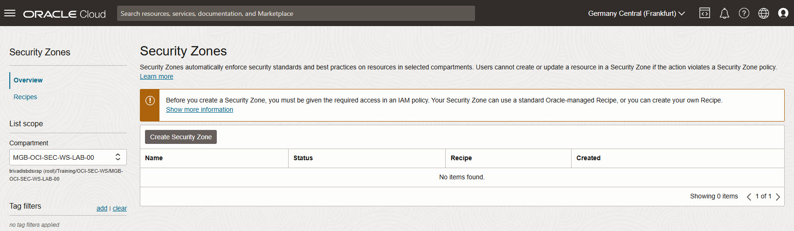
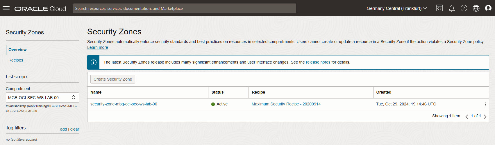

<!-- markdownlint-disable MD024 -->
<!-- markdownlint-disable MD025 -->
<!-- markdownlint-disable MD033 -->
<!-- markdownlint-disable MD041 -->

# Security Zones

## Environments {.unlisted .unnumbered}

If not explicitly stated, the exercises are usually performed on the following
environment:

- **Compartment:** OCI-SEC-WS-LAB-nn
- **Region:** Germany Central (Frankfurt)
- **OCI Console URL:**
  <a href="https://console.eu-frankfurt-1.oraclecloud.com" target="_blank" rel="noopener">
  OCI Console Frankfurt - Login</a>

Verify in OCI console you selected the correct region and for Security Zone you are
in your compartment. New resources like recipes, object storage buckets etc.,
are always created on your compartment.

## Exercise 06 - Create Security Zone

### Exercise Goals {.unlisted .unnumbered}

We create Security Zone to verify the limitations for OCI resources when create
inside such a zone.

### Tasks {.unlisted .unnumbered}

- Create Security Zone
- Create an Object Storage bucket

## Solution

Login as User XYZ in OCI console and go to _Security & Identity_ ->
_Security Zones_. Ensure you have select the proper compartment in from the
dropdown list on left side.

### Create Security Zone

In dashboard, _Create Security Zone_.

Name the resource, as example in style: security-zone-<compartment name>. As
example: security-zone-mbg-oci-sec-ws-lab-00. Add a description and click on _Create Security Zone_.

Verify the new associated compartment.

In _Security Zones_ -> _Recipes_, verify the associated Maximum Security Recipe
- 20200914.

### Create an Object Storage bucket

Ensure you have select the proper compartment in from the dropdown list on left
side to create a new Object Storage bucket. Verify the error.

Change  and use the _Customer Managed Key_ from exercise 01, as example my key
called_mek-mbg-oci-sec-ws-lab-00_.

Try to change visibility from the new created bucket to public. Verify the error
message.

### Delete Security Zone

In _Security & Identity_ -> _Security Zones_, select your security zone and delete it.

### Create a Public Object Storage

In Object Storage menu, change the visibility of created Object Storage bucket
to _PUBLIC_. Verify the visibility - a yello triangle occurs.

### Create Security Zone again

We repeat step 1, and create again the security zone in out compartment. Verify
the Violations after successful creation. Is the public bucket detected? If not,
grab a coffee and come back in a few minutes.

>> step_10

