<!-- markdownlint-disable MD024 -->
<!-- markdownlint-disable MD025 -->
<!-- markdownlint-disable MD033 -->
<!-- markdownlint-disable MD041 -->

# Web Application Firewall (WAF)

## Environments {.unlisted .unnumbered}

If not explicitly stated, the exercises are usually performed on the following
environment:

- **Compartment:** OCI-SEC-WS-LAB-nn
- **Region:** Germany Central (Frankfurt)
- **OCI Console URL:**
  <a href="https://console.eu-frankfurt-1.oraclecloud.com" target="_blank" rel="noopener">
  OCI Console Frankfurt - Login</a>

Verify in OCI console you selected the correct region and for Security Zone you
are in your compartment. New resources like recipes, object storage buckets etc.,
are always created on your compartment.

## Exercise 07 - Setup WAF for XSS Detection

### Exercise Goals {.unlisted .unnumbered}

We install a Load Balancer and WAF do detect XSS.

### Tasks {.unlisted .unnumbered}

- Setup Cloud Shell for private Network
- Install http Server on Compute Instances
- Setup Public Load Balancer
- Setup Web Application Firewall
- Verify WAF

## Solution

Login as User XYZ in OCI console. Ensure you have select the proper compartment
in from the dropdown list on left side.

### Setup Cloud Shell for private Network

In *Compute* -> *Instances*, note down the two private IP addresses of the
compute instances. As example 10.0.0.75 and 10.0.0.76.


On top of OCI Console, verify region is Germany Central (Frankfurt), open a
Cloud Shell.


When prompted for network, use private network.


Create a new private network definition:

- Name: set a name according your compartment, as example
  cloud-shell-private-network-definition
- VCN: set VCN from your compartment
- Subent: use subnet which contains the term *lab*, as example
- Checkbox: enable *Use as active network*

Click on *Create*.


Close the private network definition list and be patient, your Cloud Shell is
connected to the network. You can verify on top of the Cloud Shell when connected
properly.


In Cloud Shell, create a new directory and download Private SSH Key.

```BASH
mkdir ssh
cd ssh
wget <URL provided by trainer>
ln -s <filename> id_rsa
chmod 600 id_rsa
```

### Install http Server on Compute Instances

Login in first compute instance webserver as user opc. Use the private key from
above to connect.

```BASH
--login as user opc
ssh opc@10.0.0.75
```

```BASH
--http / php package installation
$ sudo dnf install httpd php -y
--start apache and php module
$ sudo apachectl start
$ sudo systemctl start php-fpm
--enable for server restart
$ sudo systemctl enable httpd
$ sudo systemctl enable php-fpm
--verify apache is running on port 80
$ sudo netstat -tulnp | grep http
--enable firewall
$ sudo firewall-cmd --permanent --zone=public --add-service=http
$ sudo firewall-cmd --reload
```

Create HTML Index Page and XSS PHP Page in /var/www/html

```BASH
--create index.php file
$ sudo vi /var/www/html/index.php

<?php
echo "OCI Hostname: " . gethostname();
?>
```

```BASH
--create xss demo file
$ sudo vi /var/www/html/xss_demo.php

<!DOCTYPE html>
<html lang="en">
<head>
   <meta charset="UTF-8">
   <title>XSS Demo</title>
</head>
<body>
   <h1>XSS Demo Page</h1>
   <form action="" method="get">
       <label for="name">Enter your name:</label>
       <input type="text" id="name" name="name">
       <input type="submit" value="Submit">
   </form> 
   <?php
   if (isset($_GET['name'])) {
       $name = $_GET['name'];
       // This directly outputs user input without
       // sanitization, making it vulnerable to XSS
       echo "<p>Hello, $name</p>";
   }
   ?>
</body>
</html>
```

Test running webserver. This command returns the hostname.

```BASH
curl http://localhost
```

Repeat the steps for second webserver.

### Setup Public Load Balancer

Create a Public Load Balancer in Public Subnet with the two webservers as
backend, attention: health check must set to http (as https as per default).
Verify that backend checks run to green (ok) after a while.

*Networking* -> *Load Balancer* -> *Create Load Balancer*

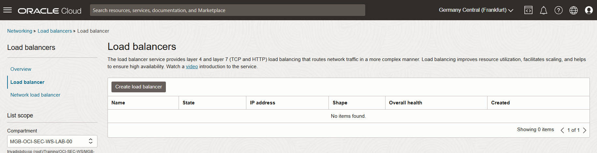

Add details:

- set name
- let visibility type as PUBLIC

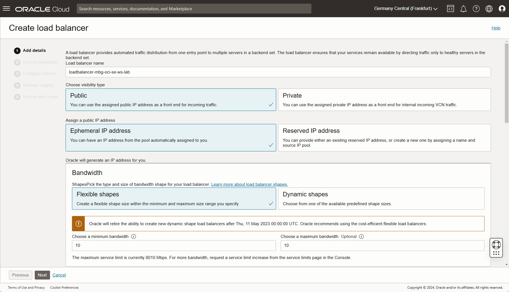

Scroll down and set:

- Virtual Cloud network
- Your public subnet

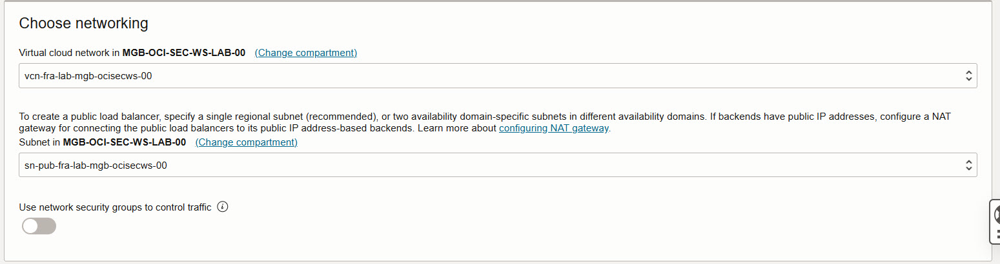

*Next*.

Choose backends:

- select backend servers and add your compute instances

Select your two webserver and add them to the list. Let port as is. Do ot change
other settings.

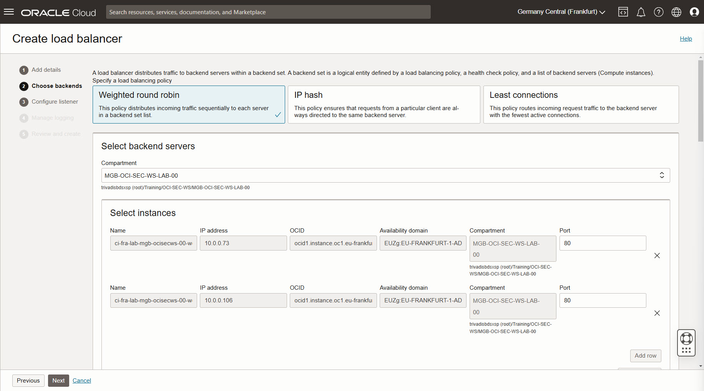

*Next*.

Configure listener:

- Change type of traffic to HTTP. Do not change other settings.

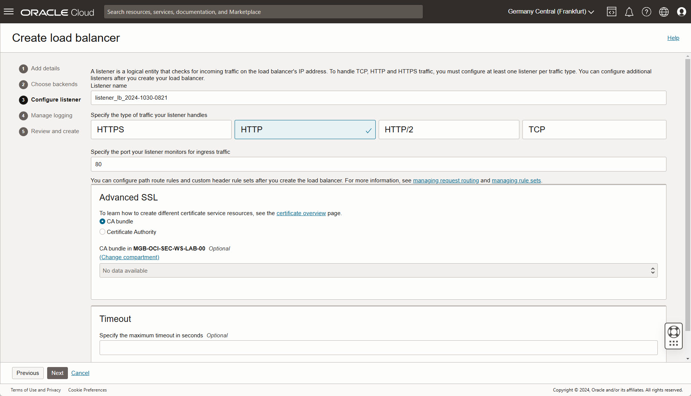

*Next*.

Manage Logging:

- Do not change settings.

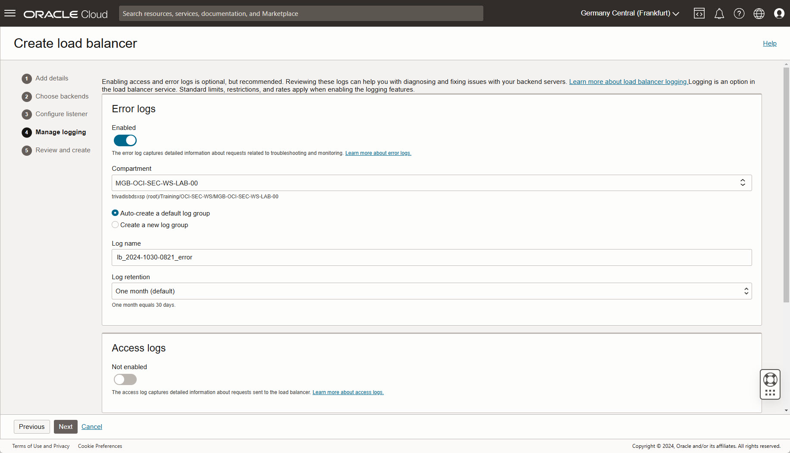

*Next*.

Review and create:

- verify settings
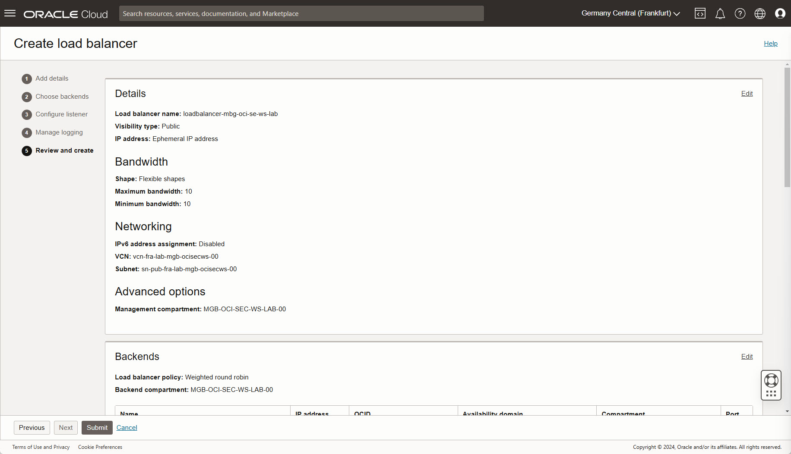

*Submit*.

The load balancer is created, wait until completed. Now you can see the load
balancer public IP in overview in section Load balancer information. The overall
health changes to ok.

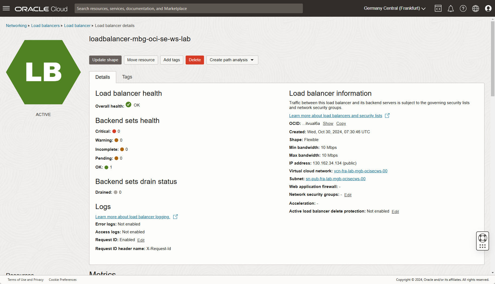

Verify reachability in a new web browser window - URL:
http://<your public load balancer ip>. Whenever the browser is refreshed, the
webserver changes from webserver01 to webserver02 and vice versa.

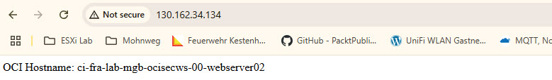

Same when using xss_demo.php as target URL: http://<your public load balancer ip>/xss_demo-php.

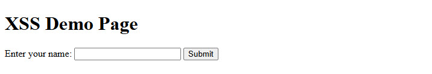

Test XSS-Injection by type in text box: <script>alert('XSS');</script> - or use
the direct URL <http://129.159.106.151/xss_demo.php?name=><script>alert('XSS');</script>.

A popup-window occurs. If there is no window, two possible reasons for:

- company network where such URLs are blocked by DNS
- popup-blocker enabled

 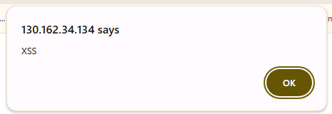

### Setup Web Application Firewall

 *Identity & Security* -> *Web Application Firewall* -> *Create WAF policy*.

 Basic information: Set a name, do not change the actions.

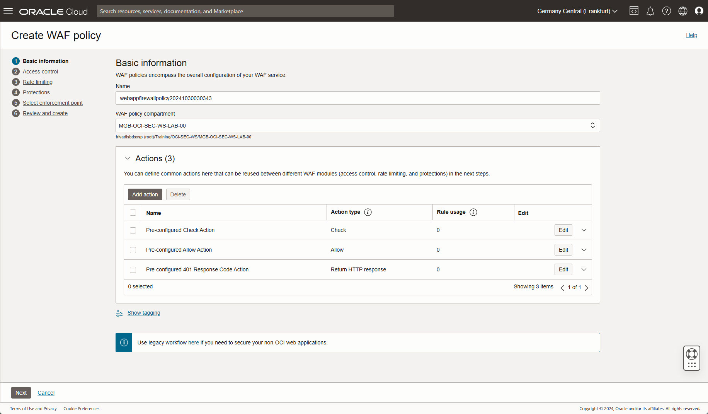

 *Next*.

 Access control: Do NOT enable the checkbox.

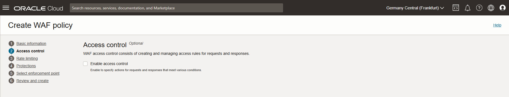

 *Next*.

 Rate limiting: Do NOT enable the checkbox.

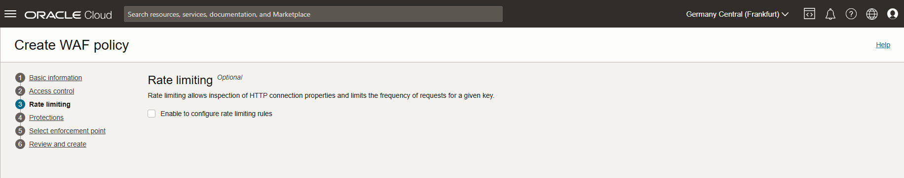

 *Next*.

 Protections: Enable checkbox and *Add request protection rule*.

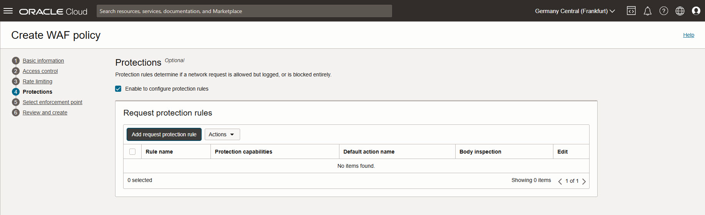

Set a name for the rule, as action name select
*Pre-configured 401 Response Code Action*.

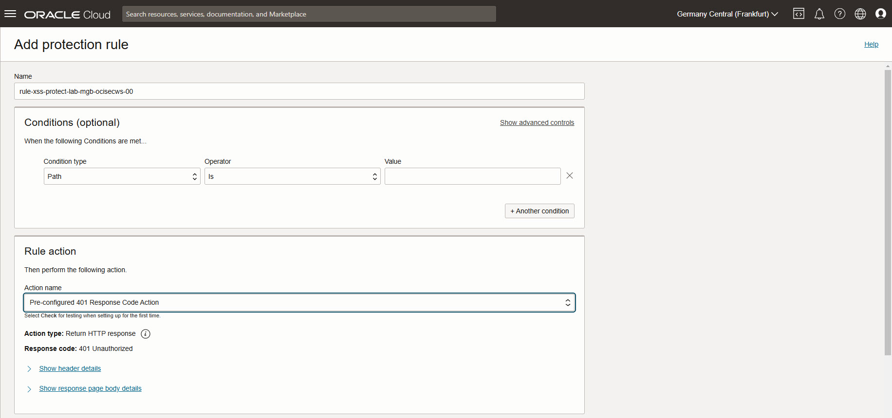

Scroll down to section *Protection capabilities*, click on
*Choose protection capabilities* to add XSS components.

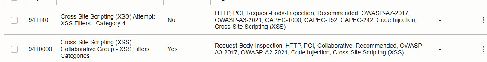

Click on button *Add request protection rule* at the bottom to add selected rule
action and protection capabilities.

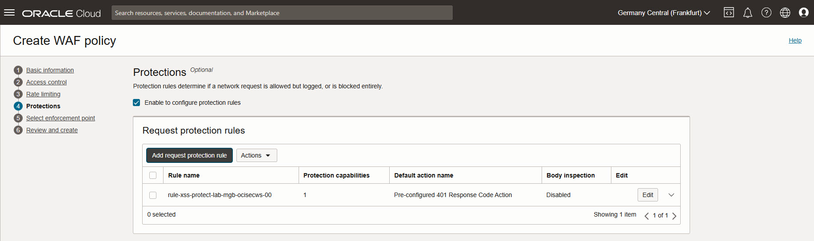

 *Next*.

Select enforcement point: select Load Balancer created above.

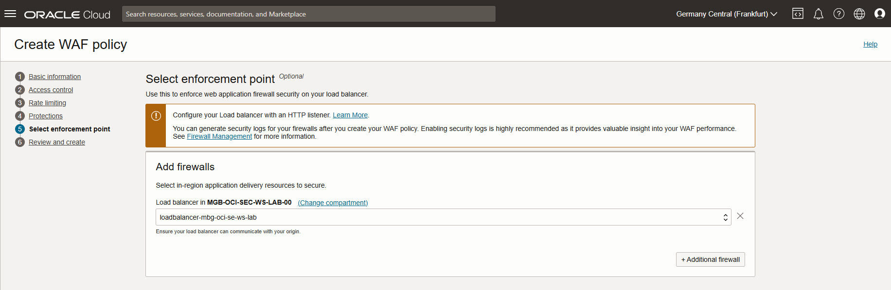

 *Next*.

Review and create: click on *Create WAF policy*. Wait a moment until policy and
firewall rule are created.

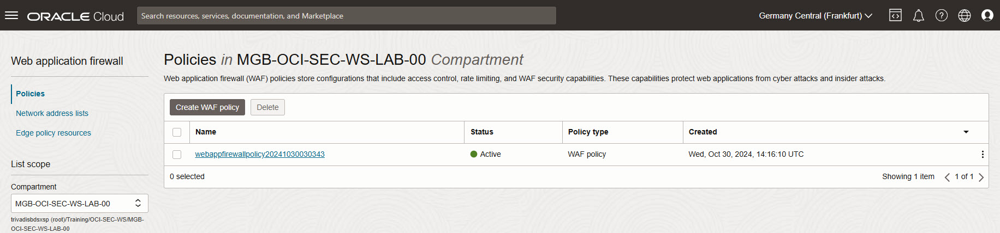

### Verify WAF

Open web browser with URL http://<your public load balancer ip>/xss_demo-php.
Enter the code snippet into the text box nd click on *Submit*.

```HTML
<script>alert('XSS');</script>
```

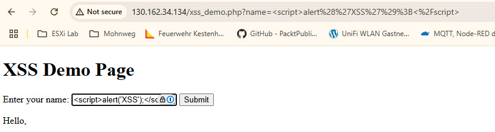

An error occurs.

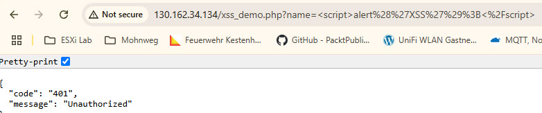

Optional:

- try to change error message with a own text
