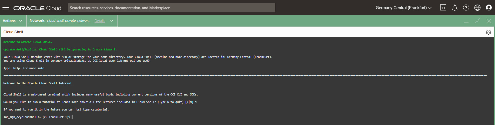

<!-- markdownlint-disable MD024 -->
<!-- markdownlint-disable MD025 -->
<!-- markdownlint-disable MD033 -->
<!-- markdownlint-disable MD041 -->

# Web Application Firewall (WAF)

## Environments {.unlisted .unnumbered}

If not explicitly stated, the exercises are usually performed on the following
environment:

- **Compartment:** OCI-SEC-WS-LAB-nn
- **Region:** Germany Central (Frankfurt)
- **OCI Console URL:**
  <a href="https://console.eu-frankfurt-1.oraclecloud.com" target="_blank" rel="noopener">
  OCI Console Frankfurt - Login</a>

Verify in OCI console you selected the correct region and for Security Zone you are
in your compartment. New resources like recipes, object storage buckets etc.,
are always created on your compartment.


## Exercise 07 - Setup WAF for XSS Detection

### Exercise Goals {.unlisted .unnumbered}

We install a Load Balancer and WAF do detect XSS.

### Tasks {.unlisted .unnumbered}

- Setup Cloud Shell for private Network
- Install http Server on Compute Instances
- Setup Load Balancer
- Setup Web Application Firewall

## Solution

Login as User XYZ in OCI console. Ensure you have select the proper compartment in from the
dropdown list on left side.

### Setup Cloud Shell for private Network

In _Compute_ -> _Instances_, note down the two private IP adresses of the compute instances. As example 10.0.0.75 and 10.0.0.76.


On top of OCI Console, verify region is Germany Central (Frankfurt), open a Cloud Shell.


When prompted for network, use private network.


Create a new private network definition:
- Name: set a name according your compartment, as example cloud-shell-private-network-definition
- VCN: set VCN from your compartment
- Subent: use subnet which contains the term _lab_, as example 
- Checkbox: enable _Use as active network_

Click on _Create_.


Close the private netzwork definition list and be patient, your Cloud Shell is connected to the network. You can verify on top of the
Cloud Shell when connected properly.



In Cloud Shell, create a new direcory and download Private SSH Key.

```
mkdir ssh
cd ssh
wget <URL provided by trainer>
ln -s <filename> id_rsa
chmod 600 id_rsa
```

### Install http Server on Compute Instances

Login in first compute instance webserver as user opc. Use the private key from above to connect.

ssh opc@10.0.0.75

--login as user opc
$ who
opc      pts/0        2024-05-30 09:26 (213.200.199.39)
 
 ```
--http / php package installation
$ sudo dnf install httpd php -y
--start apache and php module
$ sudo apachectl start
$ sudo systemctl start php-fpm
--enable for server restart
$ sudo systemctl enable httpd
$ sudo systemctl enable php-fpm
--verify apache is running on port 80
$ sudo netstat -tulnp | grep http
--enable firewall
$ sudo firewall-cmd --permanent --zone=public --add-service=http
$ sudo firewall-cmd --reload
```

Create HTML Index Page and XSS PHP Page in /var/www/html

```
--create index.php file
$ sudo vi /var/www/html/index.php

<?php
echo "Autoscale Hostname: " . gethostname();
?>
```

```
--create xss demo file
$ sudo vi /var/www/html/xss_demo.php

<!DOCTYPE html>
<html lang="en">
<head>
   <meta charset="UTF-8">
   <title>XSS Demo</title>
</head>
<body>
   <h1>XSS Demo Page</h1>
   <form action="" method="get">
       <label for="name">Enter your name:</label>
       <input type="text" id="name" name="name">
       <input type="submit" value="Submit">
   </form> 
   <?php
   if (isset($_GET['name'])) {
       $name = $_GET['name'];
       // This directly outputs user input without sanitization, making it vulnerable to XSS
       echo "<p>Hello, $name</p>";
   }
   ?>
</body>
</html>
```

Repeat the step for second webserver.


### Setup Load Balancer

